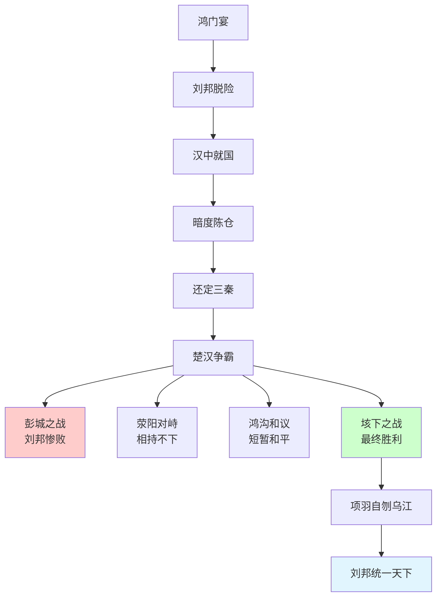
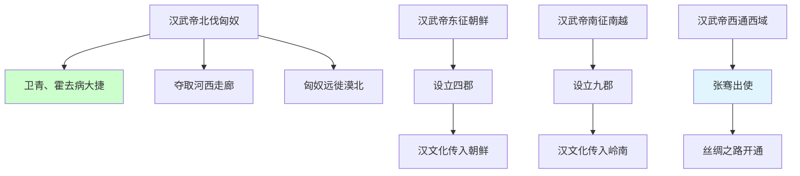
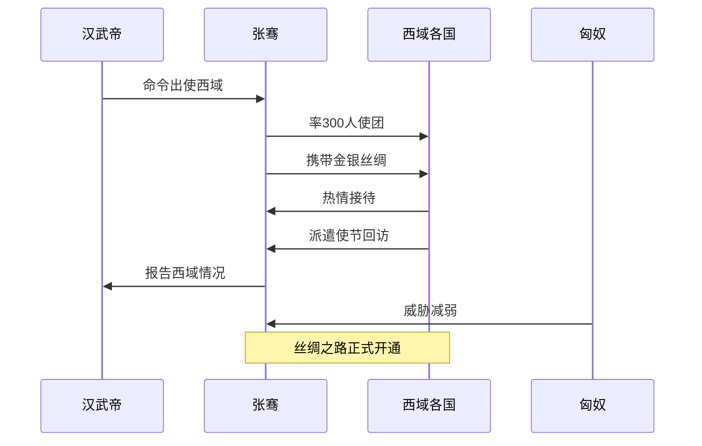
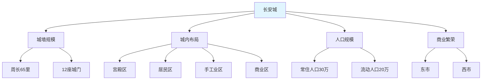

# 汉朝历史串讲：大汉雄风400年的辉煌历程

## 开国皇帝的传奇人生

### 刘邦：从草根到帝王的逆袭之路

**刘邦（前256-前195）**，汉高祖，中国历史上最传奇的开国皇帝之一：

- **草根出身**：沛县丰邑中阳里人，曾任泗水亭长
- **性格特点**：豁达大度，知人善任，善于用人
- **47岁起兵**：公元前209年响应陈胜吴广起义
- **55岁称帝**：公元前202年建立汉朝，定都长安

> 有趣的历史细节：刘邦年轻时看到秦始皇出巡的威仪，感叹道："大丈夫当如此也！"这句话体现了他远大的志向，也为后来的历史发展埋下了伏笔。

### 楚汉争霸：四年血战定乾坤

**楚汉战争（前206-前202年）** 的精彩历程：

**项羽与刘邦的对比**：
- **项羽**：勇猛善战，但刚愎自用，不善用人
- **刘邦**：军事才能一般，但知人善任，善用人才
- **结果**：个人英雄主义败给了团队协作精神

## 西汉：帝国的奠基与强盛

### 文景之治：休养生息的黄金时代

**汉文帝刘恒（前202-前157）** 和 **汉景帝刘启（前188-前141）** 父子在位期间：

**政治清明**：
- **减轻刑罚**：废除肉刑，减轻法律严苛程度
- **勤俭治国**：皇帝以身作则，减少宫廷开支
- **宽厚待民**：减轻农民负担，促进生产恢复

**经济发展**：
- **三十税一**：将农业税率降至十五分之一
- **重视农业**：以农为本，鼓励粮食生产
- **商业发展**：放松对商业的限制，促进商品流通

**社会稳定**：
- **人口增长**：从战后的1500万增长到3000多万
- **国库充裕**：粮食充裕，财政状况良好
- **边疆安定**：与匈奴保持相对和平

### 汉武帝：雄才大略的盛世君主

**刘彻（前156-前87）**，汉武帝，在位54年，汉朝最杰出的皇帝：

**开疆拓土**：

**制度创新**：
- **建立年号**：公元前140年建元，开创年号制度
- **设立太学**：公元前124年设立太学，培养人才
- **盐铁专营**：国家垄断盐铁经营，增加财政收入
- **均输平准**：国家调节物价，稳定市场

**文化统一**：
- **独尊儒术**：公元前134年，董仲舒提出"罢黜百家，独尊儒术"
- **设立五经博士**：确立儒家经典的官方地位
- **太学教育**：以儒家经典为主要教学内容
- **察举制度**：选拔人才以儒家品德为标准

### 张骞通西域：丝绸之路的开辟者

**张骞（前164-前114）**，杰出的外交家和探险家：

**第一次出使西域（前138-前126年）**：
- **使命**：联合大月氏夹击匈奴
- **过程**：被匈奴扣留10年，逃脱后继续西行
- **成果**：虽未达成军事目的，但获得了西域的详细信息
- **意义**：开辟了中西交流的通道

**第二次出使西域（前119年）**：

**丝绸之路的重要意义**：
- **经济交流**：中国丝绸、瓷器输出，西方马匹、玉石输入
- **文化交流**：佛教传入中国，中国文明西传
- **政治影响**：确立汉朝在中亚的地位
- **历史影响**：促进了东西方文明的发展

## 西汉的科技文化成就

### 司马迁与《史记》：史学的里程碑

**司马迁（前145-前86）**，伟大的史学家、文学家：

**人生遭遇**：
- **继承父志**：父亲司马谈临终嘱托完成历史著作
- **李陵之祸**：因替投降匈奴的李陵辩护而受宫刑
- **忍辱负重**：为了完成《史记》而选择屈辱地活着
- **发愤著书**：用13年时间完成《史记》

**《史记》的伟大成就**：
- **体例创新**：首创纪传体史书体裁
- **内容宏富**：记载从黄帝到汉武帝3000多年历史
- **文学价值**：文笔优美，被誉为"史家之绝唱，无韵之离骚"
- **历史影响**：成为后世史书的典范

### 汉代科技的辉煌成就

**造纸术的发明**：
- **早期纸张**：西汉已有麻质纸张
- **蔡伦改进**：东汉蔡伦改进造纸工艺
- **技术突破**：使用树皮、麻头、破布等原料
- **世界影响**：推动了人类文明的传播和发展

**天文历法成就**：
- **太初历**：汉武帝时期制定的历法
- **浑天仪**：张衡发明的天文观测仪器
- **地动仪**：世界最早的地震探测仪器
- **数学成就**：《九章算术》等数学著作

## 东汉：文化的繁荣与科技的突破

### 光武中兴：汉朝的复兴

**刘秀（前5-57）**，汉光武帝，东汉开国皇帝：

**政治改革**：
- **加强中央集权**：削弱地方豪强势力
- **整顿吏治**：选拔清廉官员，惩治贪腐
- **释放奴婢**：多次下令释放奴婢，解放生产力
- **精兵简政**：减少军费开支，减轻人民负担

**经济恢复**：
- **度田政策**：重新丈量土地，建立土地制度
- **屯田垦荒**：组织军民开垦荒地
- **减轻赋税**：三十税一的政策继续执行
- **兴修水利**：修复和新建水利工程

### 东汉科技发明的黄金时代

**蔡伦改进造纸术（105年）**：

**张衡的科学成就**：
- **浑天仪**：模拟天体运行的天文仪器
- **地动仪**：世界最早的地震探测仪器
- **候风仪**：测定风向的仪器
- **数学贡献**：计算圆周率等数学成就

**医学发展的里程碑**：

**张仲景（150-219）**：医圣
- **《伤寒杂病论》**：中医经典著作
- **辨证论治**：确立中医诊疗的基本原则
- **六经辨证**：开创中医理论体系
- **经方传世**：许多方剂至今仍在使用

**华佗（145-208）**：神医
- **麻沸散**：世界最早的全身麻醉药
- **五禽戏**：最早的健身操，模仿虎、鹿、熊、猿、鸟
- **外科手术**：擅长开腹手术等复杂手术
- **预防医学**：强调预防胜于治疗

## 汉朝的著名人物群像

### 政治家与军事家

**萧何（？-前193）**：
- **后勤专家**：为刘邦管理后方，供应粮草
- **政治智慧**：制定汉朝的典章制度
- **知人善任**：推荐韩信等人才
- **历史评价**："成也萧何，败也萧何"

**韩信（？-前196）**：
- **军事天才**：被称为"兵仙"，战无不胜
- **著名战役**：井陉之战、垓下之战等
- **悲剧结局**：被吕后设计杀害
- **军事思想**：《韩信兵法》影响深远

**卫青（？-前106）**：
- **外戚将军**：汉武帝的小舅子
- **七战七捷**：对匈奴作战屡获胜利
- **谦逊品格**：不居功自傲，深得汉武帝信任
- **历史地位**：汉匈战争的关键人物

**霍去病（前140-前117）**：
- **少年将军**：17岁开始征战生涯
- **封狼居胥**：19岁在狼居胥山筑坛祭天
- **英年早逝**：23岁病逝，汉武帝深感悲痛
- **名言传世**："匈奴未灭，何以家为！"

### 文学家与思想家

**贾谊（前200-前168）**：
- **文学天才**：18岁被汉文帝召为博士
- **《过秦论》**：分析秦朝灭亡原因
- **《治安策》**：提出治国理政的建议
- **英年早逝**：33岁抑郁而终

**董仲舒（前179-前104）**：
- **儒学大师**：提出"罢黜百家，独尊儒术"
- **天人感应**：建立天人感应的哲学体系
- **三纲五常**：确立封建社会的伦理道德
- **教育思想**：重视教育，兴办太学

**司马相如（前179-前117）**：
- **汉赋大家**：汉赋的代表作家
- **《子虚赋》《上林赋》**：铺陈华丽的汉赋杰作
- **爱情故事**：与卓文君的爱情故事流传千古
- **文学影响**：开创了汉赋的黄金时代

### 历史人物的爱情故事

**卓文君与司马相如**：
- **私奔佳话**：卓文君不顾家庭反对，与司马相如私奔
- **当垆卖酒**：夫妻二人开酒店谋生
- **白头吟**：卓文君写《白头吟》挽回感情
- **爱情典范**：成为古代自由恋爱的典范

**王昭君（前52-前15）**：
- **四大美女**：中国古代四大美女之一
- **和亲公主**：嫁给匈奴呼韩邪单于
- **和平使者**：促进了汉匈和平共处
- **文化影响**：成为文学艺术的重要题材

## 汉朝的社会生活

### 教育制度的完善

**太学教育**：
- **建立时间**：公元前124年汉武帝设立
- **学生规模**：最多时达到3万多人
- **教学内容**：以儒家五经为主要教材
- **培养目标**：为国家培养官僚人才

**察举制度**：
- **选拔方式**：地方官员推荐优秀人才
- **选拔标准**：品德、才能、学问并重
- **考试制度**：后来增加了考试环节
- **历史影响**：为后世科举制度奠定基础

### 城市发展水平

**长安城**：

**洛阳城**：
- **东汉首都**：公元25年刘秀定都洛阳
- **文化中心**：太学所在地，文化繁荣
- **商业发达**：手工业和商业都很发达
- **佛教传入**：中国第一座佛寺白马寺在洛阳

### 汉朝的日常生活

**饮食文化**：
- **主食**：以小米、小麦为主，水稻南方种植
- **副食**：各种蔬菜、肉类，调味品丰富
- **饮酒**：酿酒技术发达，饮酒文化盛行
- **宴饮**：贵族宴饮礼仪繁复

**服饰特点**：
- **汉服体系**：形成完整的服饰制度
- **等级分明**：不同等级的人服饰不同
- **男女有别**：男女服饰有明显区别
- **胡汉融合**：吸收北方民族的服饰元素

## 汉朝的衰落与历史影响

### 王莽篡汉与新朝的失败

**王莽（前45-23）**，新朝皇帝：

**篡位过程**：
- **外戚专权**：以王莽为首的外戚集团控制朝政
- **和平篡位**：公元8年，王莽接受孺子婴禅让
- **建立新朝**：改国号为"新"，建元"始建国"
- **推行改革**：推行王田制、五均六筦等改革

**改革失败原因**：
- **改革过急**：改革措施过于激进，引发社会动荡
- **执行不力**：地方官员执行不力，效果不佳
- **天灾人祸**：连年天灾加剧了社会矛盾
- **民众反抗**：绿林、赤眉等农民起义爆发

### 东汉的衰落

**外戚宦官专权**：
- **外戚专权**：皇后家族把持朝政
- **宦官专权**：宦官集团与外戚争权
- **党锢之祸**：清议士人遭到迫害
- **政治腐败**：朝政日益腐败

**黄巾起义**：
**张角（？-184）**，太平道创始人：
- **宗教组织**：创立太平道，发展信徒数十万
- **起义口号**："苍天已死，黄天当立"
- **起义规模**：波及全国，动摇了汉朝统治
- **历史影响**：导致了三国时代的到来

## 汉朝历史的深远影响

### 对中华民族的塑造

**汉族的形成**：
- **民族认同**：汉朝奠定了汉族的民族认同
- **文化传统**：建立了中华文化的基本框架
- **价值观念**：儒家的价值观成为主流
- **历史记忆**：成为中华民族的共同历史记忆

**制度的创新**：
- **郡县制度**：确立中央集权的地方制度
- **察举制度**：开创了选官制度的先河
- **太学制度**：建立了国家教育体系
- **法律制度**：汉律成为后世法律的蓝本

### 对世界文明的贡献

**丝绸之路的开辟**：
- **经济交流**：促进了东西方贸易往来
- **文化交流**：推动了文明交流互鉴
- **技术传播**：中国的技术传播到西方
- **世界影响**：促进了世界文明的发展

**科技发明的贡献**：
- **造纸术**：推动了世界文明的发展
- **医学成就**：中医学理论体系的建立
- **天文历法**：天文观测和历法制定
- **数学成就**：《九章算术》等数学著作

### 历史启示

**治国理政的智慧**：
1. **休养生息**：战后需要恢复民力
2. **重视人才**：人才是国家发展的关键
3. **文化统一**：文化认同是统一的基础
4. **开放包容**：开放促进发展进步

**历史的教训**：
1. **外戚专权**：外戚干政危害国家
2. **土地兼并**：土地问题影响社会稳定
3. **改革过急**：改革需要循序渐进
4. **民生为本**：民心是执政的基础

汉朝400年的历史，是中华民族发展史上的重要里程碑。它不仅建立了一个强大的帝国，更重要的是塑造了中华民族的基本特质，为后世2000多年的发展奠定了坚实的基础。汉朝的历史遗产，至今仍在深刻影响着我们的文化、制度和价值观。

---

*历史小知识：汉族、汉语、汉字这些称谓都来源于汉朝，可见汉朝对中华民族形成的巨大影响。汉朝建立的许多制度和文化传统，如郡县制、察举制、太学教育、儒家思想等，都成为后世中华文明的重要组成部分。*