# 区块链核心概念原理详解

## 概述

区块链技术作为分布式账本技术，通过密码学、共识机制和去中心化网络架构，实现了无需中心化信任机构的价值传递。本文将深入解析区块链的核心概念和原理。

## 区块链发展历程

### 关键时间线

#### 前智能合约时期
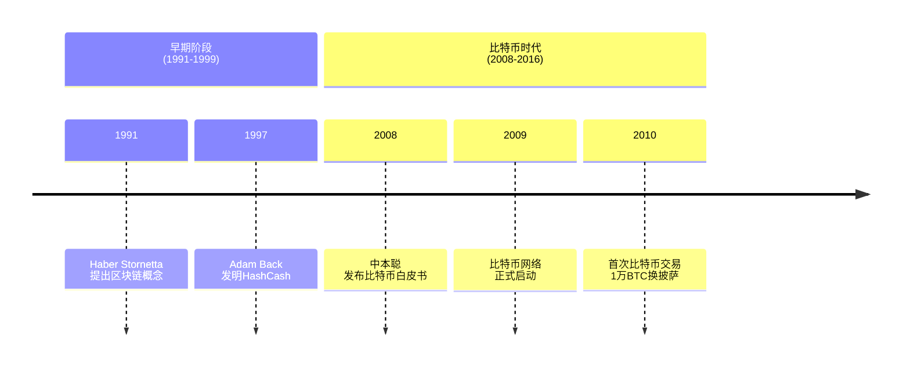

#### 智能时期
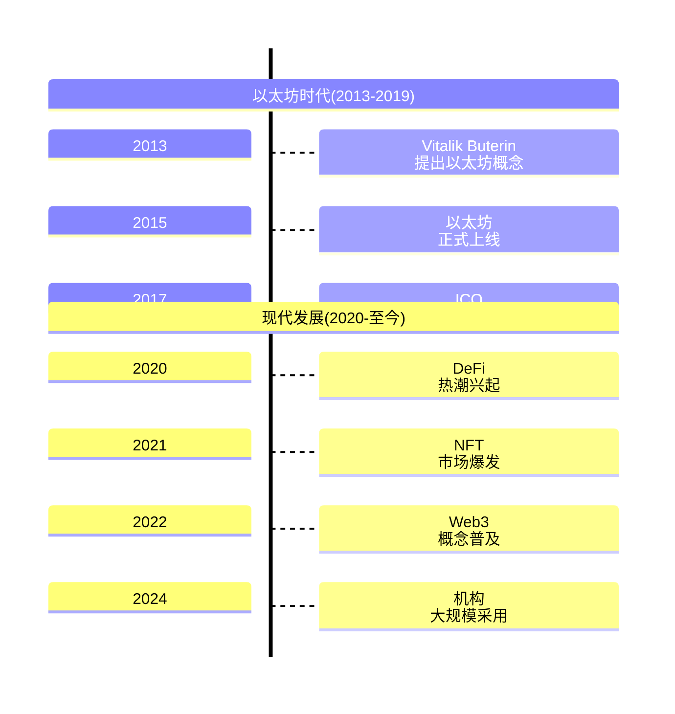


#### 📊 发展阶段总结

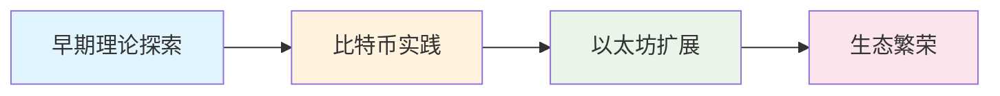

### 技术演进阶段

**第一阶段：加密货币时代（2009-2016）**
- 以比特币为代表的数字货币
- 主要解决电子现金问题
- 有限的可编程性

**第二阶段：智能合约平台（2015-2020）**
- 以太坊引入智能合约概念
- 催生ICO和代币经济
- DeFi（去中心化金融）开始发展

**第三阶段：Web3生态（2020至今）**
- NFT、GameFi、元宇宙兴起
- Layer2扩容方案成熟
- 机构资本大量进入
- 监管框架逐步完善

## 区块链基础架构

### 区块链网络结构

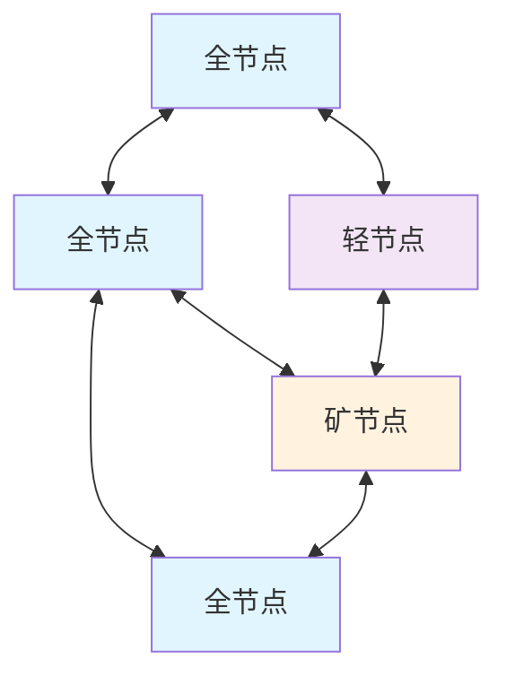

区块链网络主要由以下节点类型组成：
- **全节点**：存储完整的区块链数据，验证所有交易和区块
- **轻节点**：只存储区块头信息，依赖全节点验证交易
- **矿节点**：负责创建新区块，参与共识机制

## 核心概念详解

### 1. 区块结构

每个区块包含以下核心要素：

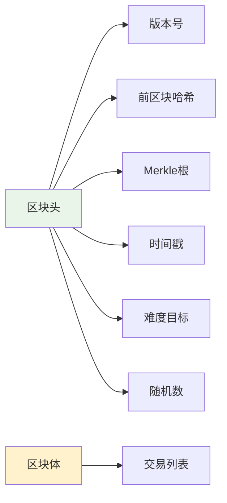

#### 区块头字段说明
- **版本号**：区块结构版本
- **前区块哈希**：指向前一个区块的哈希值，形成链式结构
- **Merkle根**：所有交易哈希构建的Merkle树的根哈希
- **时间戳**：区块创建时间
- **难度目标**：当前挖矿难度
- **随机数**：用于工作量证明的随机数

### 2. Merkle树结构

Merkle树是区块链中重要的数据结构，用于高效验证交易完整性：

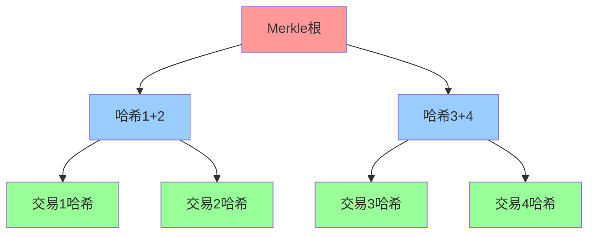

#### Merkle树优势
- **高效验证**：O(log n)时间复杂度验证任意交易
- **数据完整性**：任何交易变更都会改变Merkle根
- **节省存储**：轻节点只需存储Merkle根即可验证交易

### 3. 哈希函数与密码学基础

#### SHA-256哈希算法流程

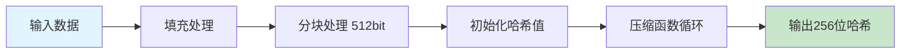

#### 密码学在区块链中的应用
- **数字签名**：使用椭圆曲线数字签名算法(ECDSA)
- **哈希指针**：连接区块，确保不可篡改性
- **地址生成**：从公钥生成区块链地址

## 共识机制

### 工作量证明(PoW)

#### PoW挖矿流程

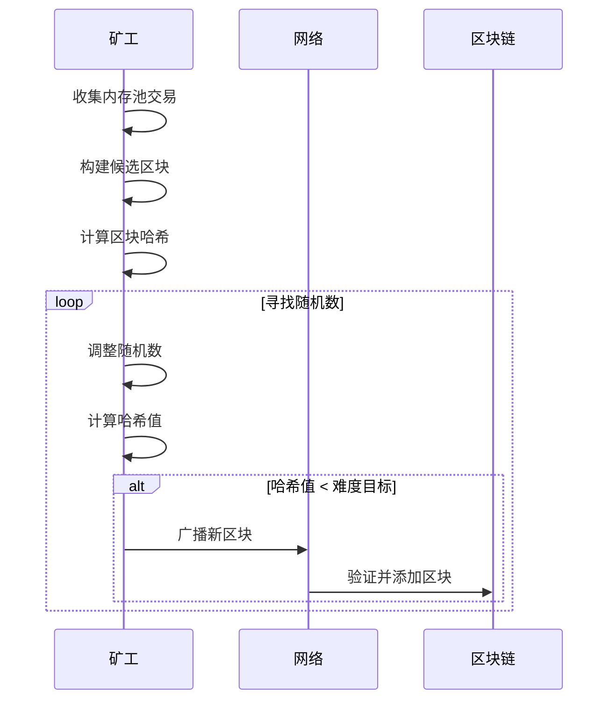

#### PoW特点
- **安全性**：高算力门槛保证网络安全
- **去中心化**：任何节点都可以参与挖矿
- **能源消耗**：需要大量电力和计算资源

### 权益证明(PoS)

#### PoS验证者选择机制

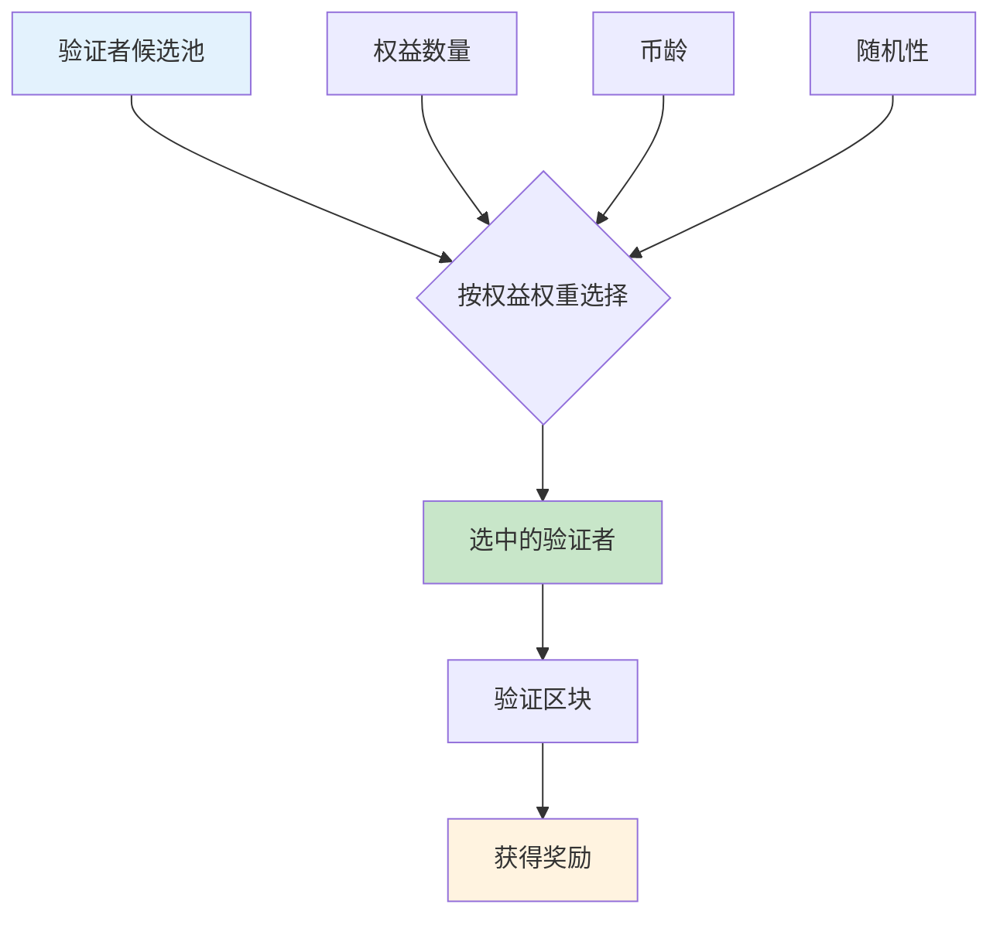

## 去中心化应用架构

### 智能合约生命周期

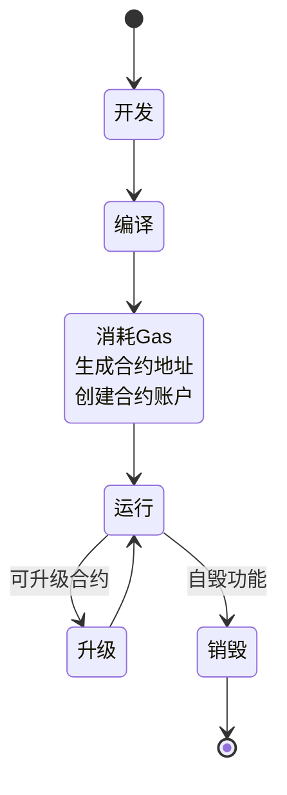

## 区块链分类

### 按访问权限分类

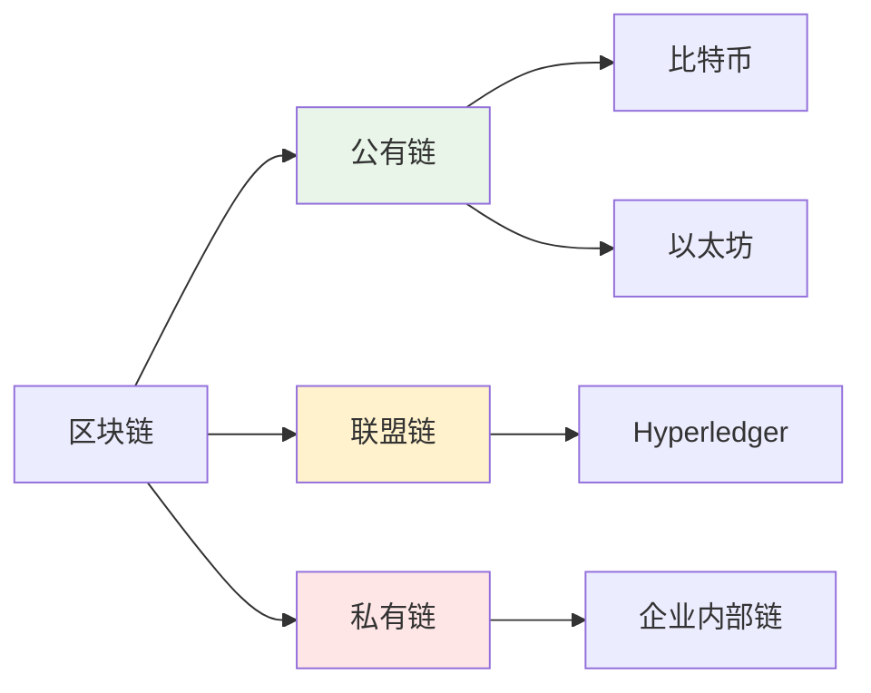

## 性能优化技术

### 分片技术架构

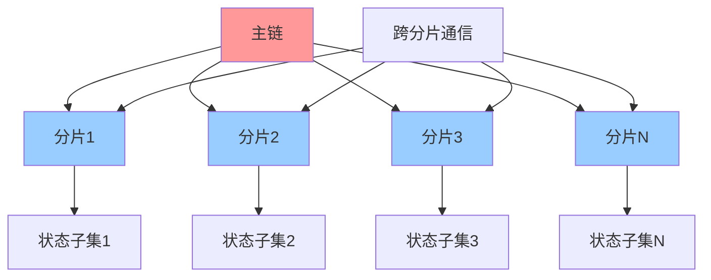

## 安全机制

### 51%攻击防御

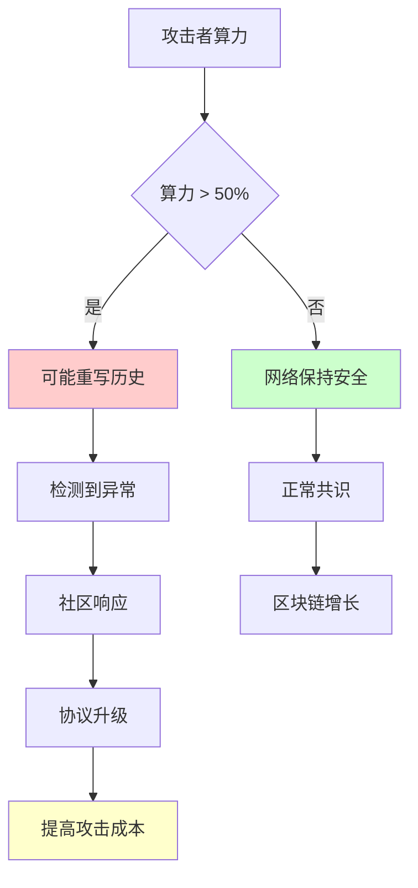

## 区块链应用场景

### 金融领域应用

#### 去中心化金融(DeFi)

**DeFi生态层次结构**

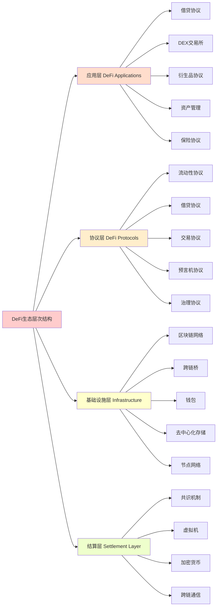

**DeFi核心协议类型**

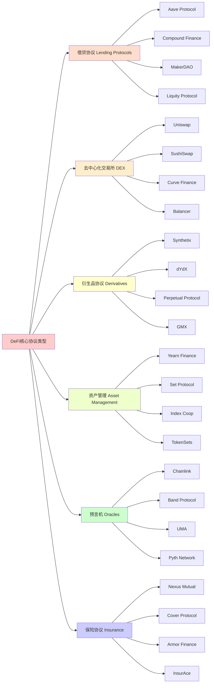

**DeFi风险类型**

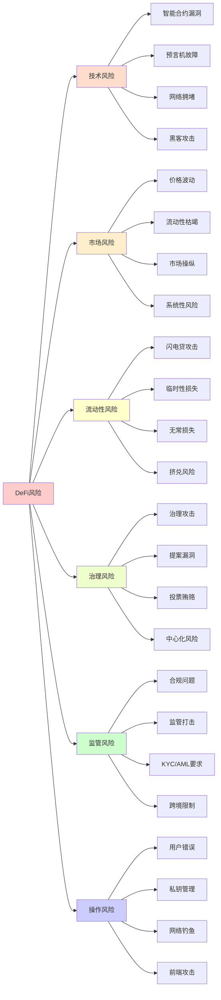

#### DeFi借贷协议机制

**借贷协议核心组件**

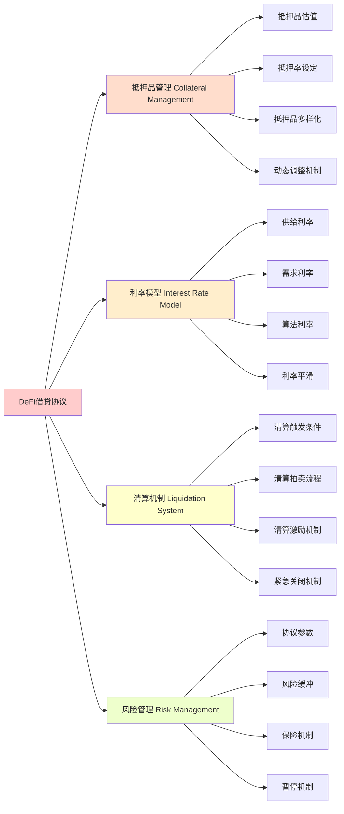

**借贷流程详解**

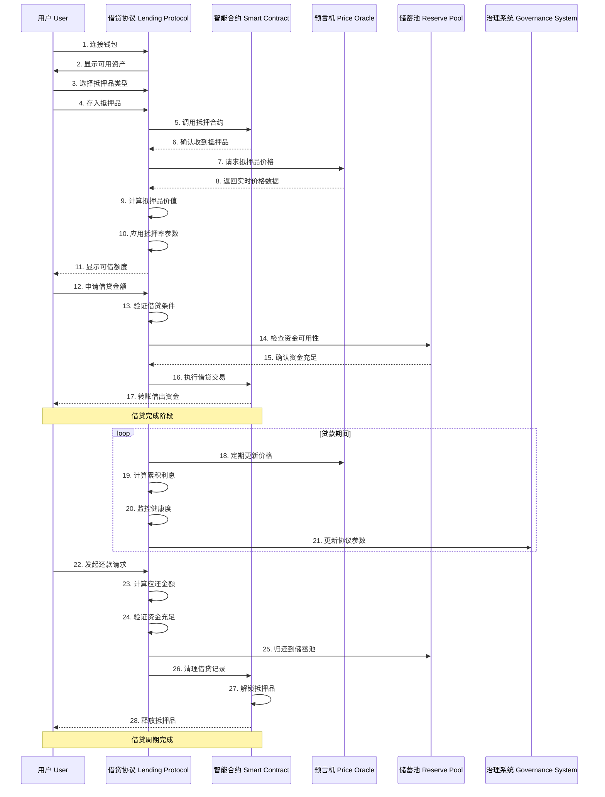

**超额抵押模型详细流程**

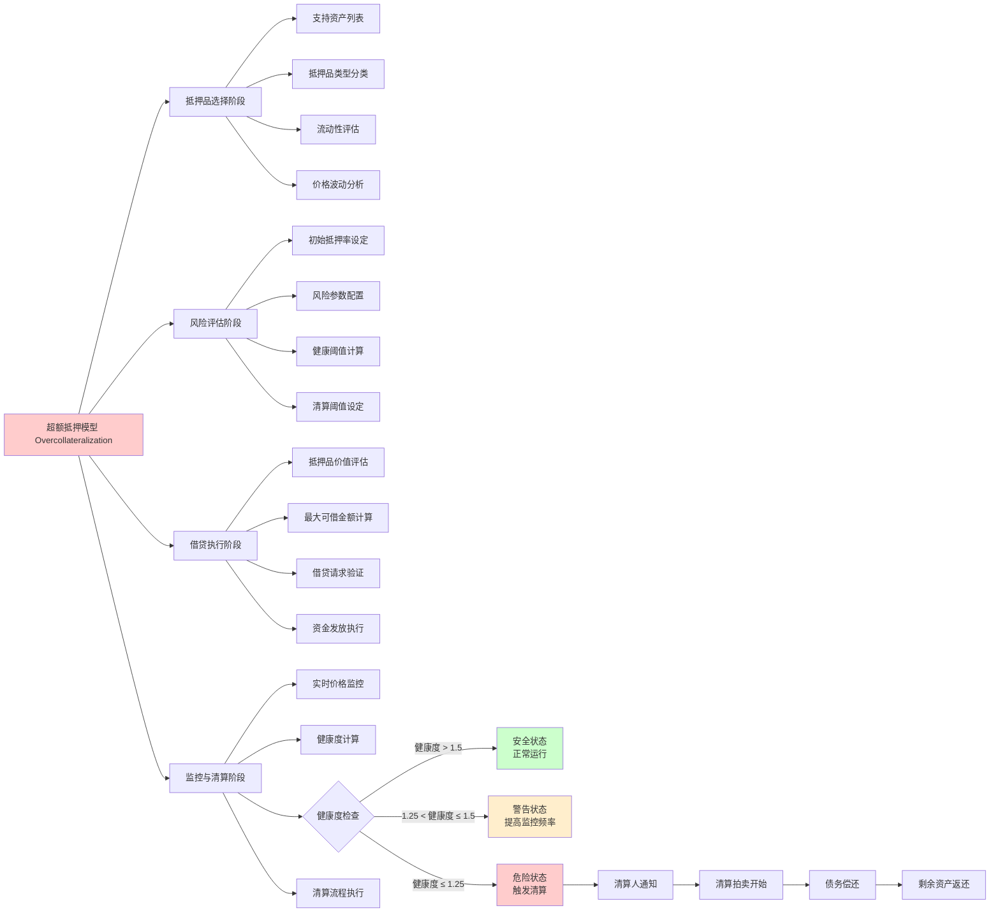

**动态利率市场机制**

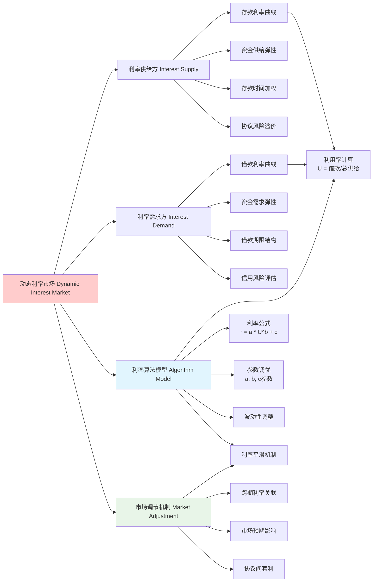

#### 流动性挖矿机制

**流动性挖矿生态系统**

```mermaid
graph LR
    A[流动性挖矿 Yield Farming] --> B[流动性提供者 Liquidity Providers]
    A --> C[挖矿协议 Mining Protocols]
    A --> D[收益机制 Reward Mechanisms]
    A --> E[风险管理 Risk Management]

    B --> B1[DEX流动性提供]
    B --> B2[借贷协议流动性]
    B --> B3[LP代币持有者]
    B --> B4[多策略流动性]

    C --> C1[单资产挖矿]
    C --> C2[LP代币挖矿]
    C --> C3[治理代币挖矿]
    C --> C4[积分挖矿]

    D --> D1[协议代币奖励]
    D --> D2[交易手续费分成]
    D --> D3[治理权益分配]
    D --> D4[特殊激励空投]

    E --> E1[无常损失监控]
    E --> E2[智能合约风险]
    E --> E3[协议安全审计]
    E --> E4[价格波动对冲]

    style A fill:#ffcccc
    style B fill:#ffddcc
    style C fill:#ffeecc
    style D fill:#ffffcc
    style E fill:#eeffcc
```

**流动性挖矿完整流程**

```mermaid
graph LR
    A[流动性挖矿完整流程] --> B[第一阶段：准备阶段]
    A --> C[第二阶段：参与阶段]
    A --> D[第三阶段：收益阶段]
    A --> E[第四阶段：优化阶段]

    B --> B1[连接钱包]
    B --> B2[选择DEX协议]
    B --> B3[分析代币对]
    B --> B4[评估风险收益]

    C --> C1[提供流动性]
    C --> C2[存入等值代币]
    C --> C3[获得LP代币]
    C --> C4[选择挖矿策略]

    D --> D1{是否参与挖矿?}
    D1 -->|是| D2[质押LP代币]
    D1 -->|否| D3[仅赚取交易费]

    D2 --> D4[单池挖矿]
    D2 --> D5[农场挖矿]
    D2 --> D6[聚合器挖矿]
    D3 --> D7[被动收益]

    E --> E8[收益复投策略]
    E --> E9[自动再平衡]
    E --> E10[风险对冲]
    E --> E11[税务优化]

    D4 --> D12[挖矿奖励获得]
    D5 --> D13[多倍奖励机制]
    D6 --> D14[智能合约策略]
    D7 --> D15[交易手续费收益]

    E8 --> E12[最终收益最大化]
    E9 --> E12
    E10 --> E12
    E11 --> E12

    style A fill:#ffcccc
    style D4 fill:#e8f5e8
    style D3 fill:#e1f5fe
```

**无常损失详细分析**

```mermaid
graph LR
    A[无常损失 Impermanent Loss Analysis] --> B[流动性提供阶段]
    A --> C[价格变动阶段]
    A --> D[套利调整阶段]
    A --> E[价值计算阶段]
    A --> F[风险控制阶段]

    B --> B1[初始代币比例 A:B = 1:1]
    B --> B2[存入等值资产 100A + 100B]
    B --> B3[LP代币铸造]
    B --> B4[流动性确认]

    C --> C1[外部市场价格变化]
    C --> C2[代币A价格上涨50%]
    C --> C3[代币B价格下跌33%]
    C --> C4[价格比率变化 A:B = 1.5:0.67]

    D --> D1[套利机会出现]
    D --> D2[套利机器人介入]
    D --> D3[买入低价代币B]
    D --> D4[卖出高价代币A]
    D --> D5[池内比例调整 A:B = 1.22: 0.82]

    E --> E1[用户取出流动性]
    E --> E2{收益计算方式}
    E --> E3[单纯持有价值 价值 = 150]
    E --> E4[流动性提供价值 价值 = 141]

    E2 --> E5["最终无常损失 IL = 6%"]

    F --> F1[监控价格变化]
    F --> F2[设置止损点]
    F --> F3[对冲策略]
    F --> F4[保险机制]

    C4 --> D1
    D5 --> E1

    style A fill:#ffcccc
    style E5 fill:#ffcccc
    style F4 fill:#e8f5e8
```

**流动性挖矿风险因素**

```mermaid
graph LR
    A[流动性挖矿风险] --> B[市场风险 Market Risk]
    A --> C[技术风险 Technical Risk]
    A --> D[协议风险 Protocol Risk]
    A --> E[操作风险 Operational Risk]

    B --> B1[价格波动风险]
    B --> B2[流动性枯竭风险]
    B --> B3[套利机器人竞争]
    B --> B4[系统性风险]

    C --> C1[智能合约漏洞]
    C --> C2[预言机故障]
    C --> C3[Gas费用激增]
    C --> C4[网络拥堵]

    D --> D1[协议暂停风险]
    D --> D2[治理攻击风险]
    D --> D3[恶意合约]
    D --> D4[升级风险]

    E --> E1[私钥管理]
    E --> E2[前端攻击]
    E --> E3[网络钓鱼]
    E --> E4[操作失误]

    B1 --> B5[无常损失放大]
    C1 --> C5[资金损失]
    D1 --> D5[奖励中断]
    E1 --> E5[资产丢失]

    style A fill:#ffcccc
    style B fill:#ffddcc
    style C fill:#ffeecc
    style D fill:#ffffcc
    style E fill:#eeffcc
```

#### 杠杆交易机制

**杠杆交易架构体系**

```mermaid
graph LR
    A[杠杆交易机制] --> B[交易参与者]
    A --> C[资金杠杆化]
    A --> D[交易策略执行]
    A --> E[风险管理系统]

    B --> B1[杠杆交易者]
    B --> B2[流动性提供者]
    B --> B3[套利机器人]
    B --> B4[清算机器人]

    C --> C1[抵押品存入]
    C --> C2[杠杆倍数设定]
    C --> C3[借入资金]
    C --> C4[保证金管理]

    D --> D1[DEX交易执行]
    D --> D2[衍生品合约]
    D --> D3[套利策略]
    D --> D4[自动化交易]

    E --> E1[实时监控]
    E --> E2[自动平仓]
    E --> E3[保险机制]
    E --> E4[风险分散]

    style A fill:#ff5252,color:#fff
    style B fill:#ff9800,color:#fff
    style C fill:#ffc107,color:#000
    style D fill:#4caf50,color:#fff
    style E fill:#2196f3,color:#fff
```

**清算机制流程**

```mermaid
sequenceDiagram
    participant P as 价格预言机
    participant L as 借贷协议
    participant M as 监控系统
    participant C as 清算机器人
    participant U as 用户

    P->>M: 抵押品价格大幅下跌
    M->>L: 计算健康度
    L->>L: 健康度 < 清算阈值?

    alt 触发清算
        L->>C: 发布清算信号
        C->>L: 执行清算操作
        C->>C: 偿免竞争者抢跑
        C->>L: 偿还债务
        L->>C: 奖励清算费用
        L->>U: 剩余抵押品返还
    else 安全状态
        L->>M: 继续监控
    end

    note over P,U: 全自动化清算过程，确保协议安全
```

#### 价格预言机架构

**价格预言机架构体系**

```mermaid
graph TD
    A[价格预言机架构] --> B[数据源层 Data Sources]
    A --> C[预言机网络层 Oracle Network]
    A --> D[数据处理层 Data Processing]
    A --> E[区块链集成层 Blockchain Integration]

    B --> B1[API数据提供商]
    B --> B2[交易所数据]
    B --> B3[传统金融数据]
    B --> B4[物联网设备]

    C --> C1[节点运营商]
    C --> C2[声誉系统]
    C --> C3[共识机制]
    C --> C4[激励机制]

    D --> D1[数据聚合算法]
    D --> D2[异常值检测]
    D --> D3[数据验证]
    D --> D4[质量评估]

    E --> E1[智能合约接口]
    E --> E2[价格数据传输]
    E --> E3[随机数生成]
    E --> E4[API调用服务]

    B1 --> C1
    B2 --> C1
    B3 --> C1
    B4 --> C1

    C1 --> D1
    D1 --> E1

    style A fill:#ff5252,color:#fff
    style B fill:#ff9800,color:#fff
    style C fill:#ffc107,color:#000
    style D fill:#4caf50,color:#fff
    style E fill:#2196f3,color:#fff
```

**预言机安全机制体系**

```mermaid
graph TD
    A[预言机安全机制] --> B[数据验证安全 Data Validation]
    A --> C[网络安全保障 Network Security]
    A --> D[共识机制安全 Consensus Security]
    A --> E[系统完整性安全 System Integrity]

    B --> B1[数据源验证]
    B --> B2[异常值检测]
    B --> B3[数据一致性检查]
    B --> B4[质量评估机制]

    C --> C1[节点分散化]
    C --> C2[网络通信加密]
    C --> C3[DDoS攻击防护]
    C --> C4[节点身份验证]

    D --> D1[声誉权重系统]
    D --> D2[共识算法安全]
    D --> D3[投票机制验证]
    D --> D4[惩罚与奖励机制]

    E --> E1[加密签名验证]
    E --> E2[时间戳防篡改]
    E --> E3[智能合约审计]
    E --> E4[故障恢复机制]

    B3 --> B5{数据一致性}
    B5 -->|一致| B6[数据输出到区块链]
    B5 -->|不一致| B7[重新采样数据]

    B6 --> B8[智能合约更新]
    B7 --> B1

    style A fill:#ff5252,color:#fff
    style B fill:#ff9800,color:#fff
    style C fill:#ffc107,color:#000
    style D fill:#4caf50,color:#fff
    style E fill:#2196f3,color:#fff
    style B6 fill:#4caf50,color:#fff
    style B7 fill:#ff5252,color:#fff
```

#### 跨链桥接机制

**跨链桥接技术架构**

```mermaid
graph TD
    A[跨链桥接技术] --> B[源链处理层 Source Chain]
    A --> C[中继验证层 Relay Layer]
    A --> D[目标链处理层 Target Chain]
    A --> E[安全验证层 Security]

    B --> B1[用户锁定资产]
    B --> B2[源链桥接合约]
    B --> B3[事件监听机制]
    B --> B4[状态变更记录]

    C --> C1[验证者网络]
    C --> C2[跨链共识机制]
    C --> C3[消息传递协议]
    C --> C4[状态同步系统]

    D --> D1[包装资产铸造]
    D --> D2[资产释放机制]
    D --> D3[最终性确认]
    D --> D4[交易验证]

    E --> E1[验证者质押]
    E --> E2[签名验证]
    E --> E3[欺诈证明]
    E --> E4[紧急暂停机制]

    B1 --> B2
    B2 --> B3
    B3 --> C1
    C1 --> C2
    C2 --> C3
    C3 --> C4
    C4 --> D1
    D1 --> D2
    D2 --> D3

    C1 --> E1
    E1 --> E2
    E2 --> E3

    style A fill:#ff5252,color:#fff
    style B fill:#ff9800,color:#fff
    style C fill:#ffc107,color:#000
    style D fill:#4caf50,color:#fff
    style E fill:#2196f3,color:#fff
```

**跨链桥安全风险体系**

```mermaid
graph TD
    A[跨链桥安全风险] --> B[验证者风险 Validator Risk]
    A --> C[智能合约风险 Smart Contract Risk]
    A --> D[网络安全风险 Network Risk]
    A --> E[流动性风险 Liquidity Risk]
    A --> F[操作风险 Operational Risk]

    B --> B1[验证者串通攻击]
    B --> B2[质押不足风险]
    B --> B3[中心化控制风险]
    B --> B4[响应延迟风险]

    C --> C1[智能合约漏洞]
    C --> C2[升级风险]
    C --> C3[权限管理风险]
    C --> C4[逻辑错误风险]

    D --> D1[51%攻击]
    D --> D2[网络分区攻击]
    D --> D3[DDoS攻击]
    D --> D4[MEV攻击]

    E --> E1[流动性不足]
    E --> E2[滑点过高]
    E --> E3[价格操纵]
    E --> E4[套利风险]

    F --> F1[操作失误风险]
    F --> F2[前端攻击风险]
    F --> F3[治理攻击风险]
    F --> F4[监管合规风险]

    B1 --> B5[资金损失]
    C1 --> C5[资产被盗]
    D1 --> D5[网络瘫痪]
    E1 --> E5[交易失败]
    F1 --> F5[系统崩溃]

    style A fill:#ff5252,color:#fff
    style B fill:#ff9800,color:#fff
    style C fill:#ffc107,color:#000
    style D fill:#4caf50,color:#fff
    style E fill:#2196f3,color:#fff
    style F fill:#9c27b0,color:#fff
```

#### DeFi组合策略

**Yearn Finance收益聚合器**

```mermaid
graph TD
    A[用户存入资金] --> B[自动策略选择]
    B --> C{策略类型}

    C -->|稳定币| D[Curve策略]
    C -->|波动性代币| E[Uniswap流动性]
    C -->|高收益| F[杠杆挖矿]

    D --> G[收益优化]
    E --> G
    F --> G

    G --> H[自动复投]
    H --> I[手续费最小化]
    I --> J[风险分散]

    J --> K[用户收益最大化]

    subgraph "风险控制"
        L[策略回测]
        M[实时监控]
        N[自动止损]
        O[保险机制]
    end

    G --> L
    L --> M
    M --> N
    N --> O

    style K fill:#c8e6c9
```

**自动做市商(AMM)机制**

```mermaid
graph LR
    A[流动性池] --> B[自动定价机制]

    subgraph "恒定乘积公式"
        C[x * y = k]
        D[流动性供给量]
        E[价格滑点计算]
    end

    B --> C
    B --> D
    B --> E

    C --> F[买卖执行]

    subgraph "套利机制"
        G[外部市场价格]
        H[内部池价格]
        I[套利机器人]
    end

    G --> I
    H --> I
    I --> F

    F --> J[手续费分配]
    J --> K[流动性提供者]
    J --> L[协议金库]

    style C fill:#e1f5fe
    style I fill:#e8f5e8
```

### 供应链管理

#### 区块链供应链追溯系统

```mermaid
graph TB
    A[原材料供应商] --> B[生产商]
    B --> C[物流公司]
    C --> D[分销商]
    D --> E[零售商]
    E --> F[消费者]

    G[区块链账本] --> A
    G --> B
    G --> C
    G --> D
    G --> E
    G --> F

    H[扫描二维码] --> F
    H --> G

    style G fill:#e1f5fe
    style H fill:#fff3e0
```

**应用案例：**
- **食品安全**：沃尔玛使用区块链追踪食品来源
- **药品溯源**：防止假药流通
- **奢侈品鉴定**：验证产品真实性
- **碳排放追踪**：监测碳足迹

### 数字身份认证

#### 去中心化身份(DID)系统

```mermaid
graph LR
    A[用户] --> B[DID标识符]
    B --> C[数字钱包]
    C --> D[身份证明]
    D --> E[服务提供商]

    F[区块链] --> B
    G[政府机构] --> D
    H[教育机构] --> D

    style B fill:#e8f5e8
    style F fill:#e1f5fe
```

**优势：**
- **用户控制**：个人掌控自己的身份数据
- **防篡改**：身份信息不可伪造
- **隐私保护**：选择性信息披露
- **跨平台互操作**：一次注册，多处使用

### 知识产权保护

#### NFT版权保护流程

```mermaid
sequenceDiagram
    participant C as 创作者
    participant S as 智能合约
    participant B as 区块链
    participant U as 用户

    C->>S: 创建NFT作品
    S->>B: 记录版权信息
    U->>S: 购买NFT
    S->>B: 转移所有权
    B->>U: 确认所有权

    note over C,U: 版权信息永久记录在区块链上
```

**应用领域：**
- **数字艺术**：确保艺术品唯一性
- **音乐版权**：自动版税分配
- **文学作品**：防止盗版
- **游戏资产**：虚拟道具所有权

### 投票系统

#### 区块链投票架构

```mermaid
graph TD
    A[选民身份验证] --> B[生成投票令牌]
    B --> C[加密投票]
    C --> D[区块链记录]
    D --> E[实时计票]
    E --> F[结果公示]

    G[身份管理系统] --> A
    H[加密算法] --> C
    I[共识机制] --> D

    style D fill:#e1f5fe
    style F fill:#c8e6c9
```

**特点：**
- **匿名性**：保护选民隐私
- **透明性**：投票过程公开透明
- **不可篡改**：防止选票被修改
- **可审计**：第三方可验证结果

## 加密货币基础知识

### 比特币详解

#### 比特币挖矿原理

```mermaid
flowchart TD
    A[待确认交易] --> B[内存池]
    B --> C[矿工选择交易]
    C --> D[构建候选区块]
    D --> E[计算区块哈希]
    E --> F{哈希值符合难度?}
    F -->|否| G[调整随机数]
    G --> E
    F -->|是| H[广播新区块]
    H --> I[其他节点验证]
    I --> J[添加到区块链]
    J --> K[矿工获得奖励]

    style F fill:#fff3e0
    style K fill:#c8e6c9
```

**比特币特点：**
- **总量有限**：最多2100万枚
- **挖矿奖励减半**：每4年减半一次
- **去中心化**：无中央管理机构
- **匿名性**：假名系统

### 以太坊和智能合约

#### 智能合约执行流程

```mermaid
sequenceDiagram
    participant U as 用户
    participant W as 钱包
    participant E as 以太坊网络
    participant SC as 智能合约
    participant B as 区块链

    U->>W: 发起交易
    W->>W: 签名交易
    W->>E: 广播交易
    E->>SC: 执行合约代码
    SC->>SC: 状态变更
    SC->>B: 记录结果
    B->>E: 确认交易
    E->>U: 返回结果
```

**以太坊特点：**
- **图灵完备**：支持复杂计算
- **Gas费用**：执行成本计量
- **ERC标准**：代币标准化
- **DeFi生态**：丰富的金融应用

### 稳定币机制

#### 稳定币分类体系

```mermaid
graph TB
    A[稳定币] --> B[法币抵押型]
    A --> C[加密资产抵押型]
    A --> D[算法型]

    B --> E[USDT]
    B --> F[USDC]
    B --> G[BUSD]

    C --> H[DAI]
    C --> I[LUSD]

    D --> J[Terra Luna-历史]
    D --> K[Frax]

    style B fill:#e8f5e8
    style C fill:#fff2cc
    style D fill:#ffe6e6
```

**稳定币作用：**
- **价值储存**：对冲加密货币波动
- **交易媒介**：便捷的支付工具
- **DeFi基础**：去中心化金融的基础设施
- **跨境支付**：降低汇款成本

## Web3和去中心化互联网

### Web3技术栈

#### Web3架构层次

```mermaid
graph TB
    A[应用层 DApps] --> B[协议层]
    B --> C[网络层]
    C --> D[基础设施层]

    subgraph "应用层"
        A1[DeFi应用]
        A2[NFT市场]
        A3[GameFi]
        A4[社交平台]
    end

    subgraph "协议层"
        B1[智能合约]
        B2[DAO治理]
        B3[代币经济]
    end

    subgraph "网络层"
        C1[以太坊]
        C2[Polygon]
        C3[Arbitrum]
    end

    subgraph "基础设施层"
        D1[节点网络]
        D2[存储系统]
        D3[预言机]
    end

    style A fill:#e1f5fe
    style B fill:#e8f5e8
    style C fill:#fff2cc
    style D fill:#ffe6e6
```

### DAO（去中心化自治组织）

#### DAO治理机制

```mermaid
graph TD
    A[提案] --> B[社区讨论]
    B --> C[投票]
    C --> D{通过?}
    D -->|是| E[执行]
    D -->|否| F[拒绝]
    E --> G[结果记录]

    H[代币持有者] --> C
    I[治理合约] --> C
    J[时间锁] --> E

    style D fill:#fff3e0
    style G fill:#c8e6c9
```

**DAO特点：**
- **去中心化治理**：社区共同决策
- **透明运作**：所有决策公开
- **自动化执行**：智能合约自动执行
- **代币经济**：激励机制设计

## 区块链技术优势与局限性

### 技术优势

#### 区块链核心优势

```mermaid
radar-beta
    title 区块链技术优势分析
    axis 安全性["高安全性"], 透明性["高透明性"], 去中心化["去中心化"], 不可篡改["不可篡改"]

    curve {区块链: 90, 85, 95, 88}
    curve {传统系统: 60, 30, 20, 40}
```

**具体优势：**
1. **去中心化**：无单点故障，抗审查
2. **不可篡改**：历史记录无法修改
3. **透明性**：交易数据公开可验证
4. **安全性**：密码学保护，抗攻击
5. **全球性**：无国界，7×24小时运行
6. **低成本**：去除中介，降低成本

### 技术局限性

#### 主要挑战

```mermaid
graph TD
    A[区块链挑战] --> B[技术挑战]
    A --> C[经济挑战]
    A --> D[监管挑战]
    A --> E[用户体验挑战]

    B --> B1[可扩展性]
    B --> B2[互操作性]
    B --> B3[隐私保护]

    C --> C1[能源消耗]
    C --> C2[价格波动]
    C --> C3[监管成本]

    D --> D1[法律框架]
    D --> D2[合规要求]
    D --> D3[跨境监管]

    E --> E1[使用复杂]
    E --> E2[教育门槛]
    E --> E3[风险认知]

    style B fill:#ffcccc
    style C fill:#ffffcc
    style D fill:#ccffcc
    style E fill:#ccccff
```

**扩容解决方案：**
- **Layer2方案**：状态通道、Rollups
- **分片技术**：并行处理交易
- **跨链技术**：不同区块链间通信

## 区块链学习指南

### 学习路径

#### 从入门到精通的学习路线

```mermaid
journey
    title 区块链学习之旅
    section 初级阶段
      基础概念: 3: 学习者
      比特币原理: 4: 学习者
      钱包使用: 3: 学习者
    section 中级阶段
      智能合约: 5: 开发者
      DeFi应用: 4: 用户
      安全基础: 4: 学习者
    section 高级阶段
      协议设计: 5: 架构师
      跨链技术: 4: 开发者
      经济模型: 5: 设计师
```

### 推荐学习资源

#### 入门资源
- **在线课程**：Coursera区块链专项课程
- **技术文档**：比特币白皮书、以太坊黄皮书
- **实践平台**：Remix IDE、Testnet测试网
- **社区论坛**：Reddit、Discord、Telegram

#### 进阶资源
- **开源项目**：Bitcoin Core、Go-Ethereum
- **学术论文**：ACM、IEEE相关论文
- **技术博客**：Vitalik Buterin博客
- **开发工具**：Hardhat、Truffle框架

### 实践项目建议

#### 新手友好项目
1. **简单DApp开发**：投票系统、众筹平台
2. **NFT项目**：数字艺术品、收藏品
3. **DeFi协议**：简单的借贷、交换协议
4. **游戏应用**：区块链游戏、元宇宙

#### 学习重点
- **Solidity编程**：智能合约开发语言
- **Web3.js/Ethers.js**：前端与区块链交互
- **安全审计**：智能合约安全检测
- **经济设计**：代币经济学原理

## 总结

区块链技术通过密码学、共识机制和分布式架构，实现了无需信任第三方的价值传递。核心特性包括：

1. **不可篡改性**：通过哈希链和Merkle树确保数据完整性
2. **去中心化**：分布式网络架构消除单点故障
3. **透明性**：所有交易公开可验证
4. **安全性**：密码学保护确保系统安全

随着技术的发展，区块链正在从单纯的数字货币系统向复杂的去中心化应用平台演进，为构建可信任的数字经济基础设施提供技术支撑。