# EVM账户模型详解

## 概述

以太坊虚拟机(EVM)的账户模型是以太坊区块链的核心组件之一，它定义了以太坊上状态存储和管理的基本单元。理解EVM账户模型对于开发智能合约和DApp至关重要。

## EVM账户基础

### 账户类型

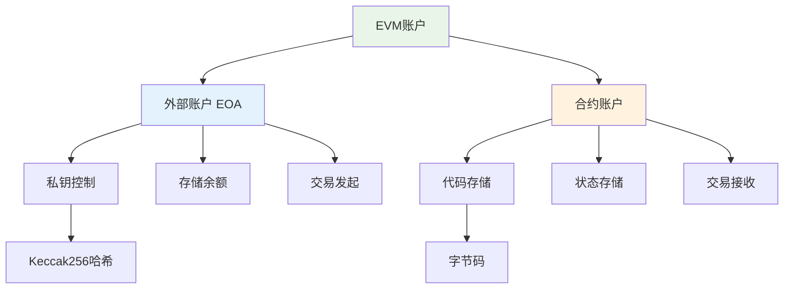

### 账户结构组成

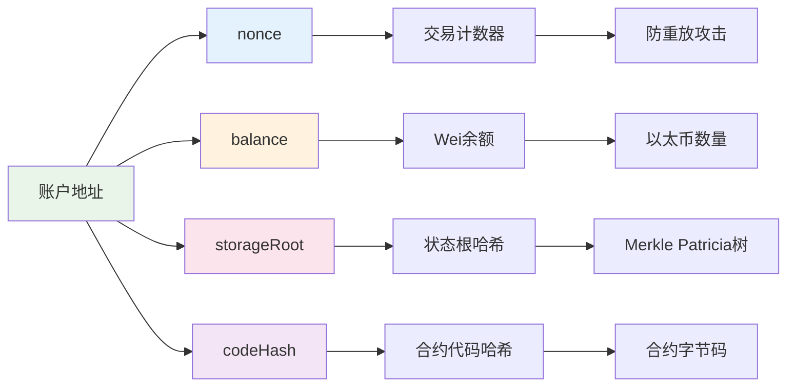

## 外部账户(EOA)详解

### 账户生成过程

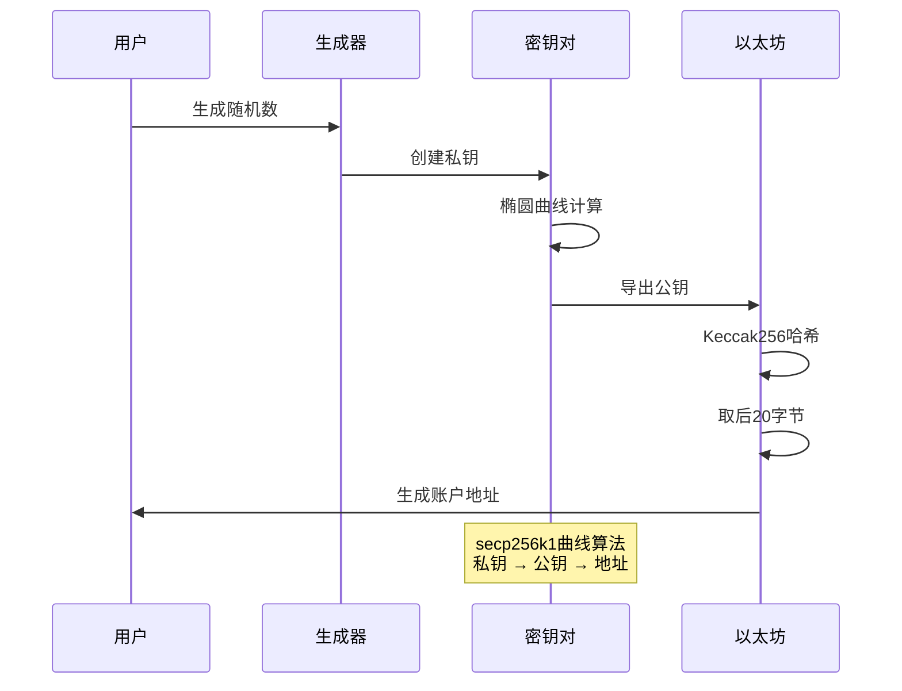

### 私钥和公钥关系

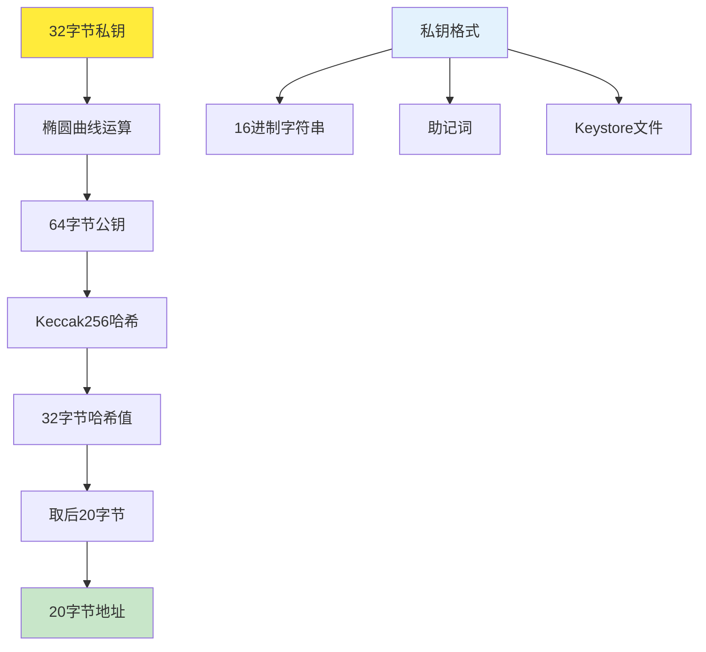

## 合约账户详解

### 合约创建流程

```mermaid
flowchart TD
    A[发送交易] --> B{接收地址为空?}
    B -->|是| C[合约创建]
    B -->|否| D[普通转账]
    
    C --> E[设置nonce]
    E --> F[执行构造函数]
    F --> G[计算合约地址]
    G --> H[存储合约代码]
    H --> I[初始化状态变量]
    I --> J[返回合约地址]
    
    G --> K[CREATE公式]
    K --> L[keccak256(sender, nonce)]
    
    style C fill:#e8f5e8
    style G fill:#e3f2fd
    style L fill:#fff3e0
```

### 合约地址计算

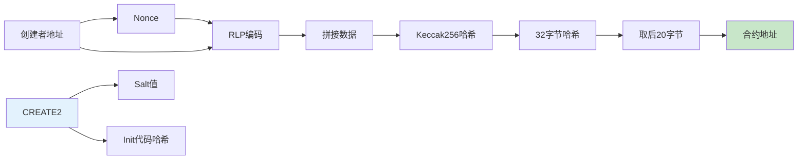

## 状态存储机制

### 全局状态树

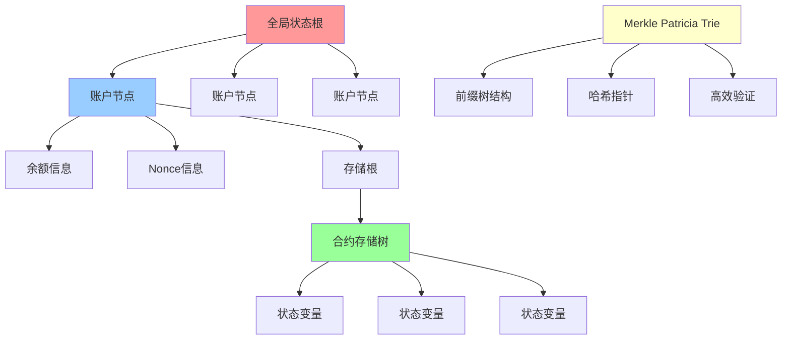

### 存储槽布局

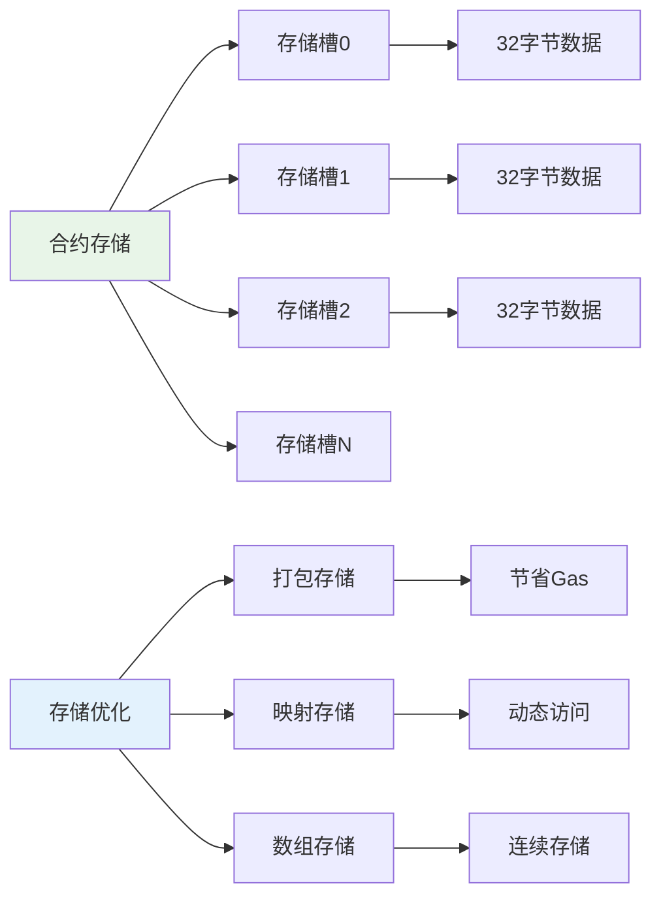

## 交易和Gas机制

### 交易执行流程

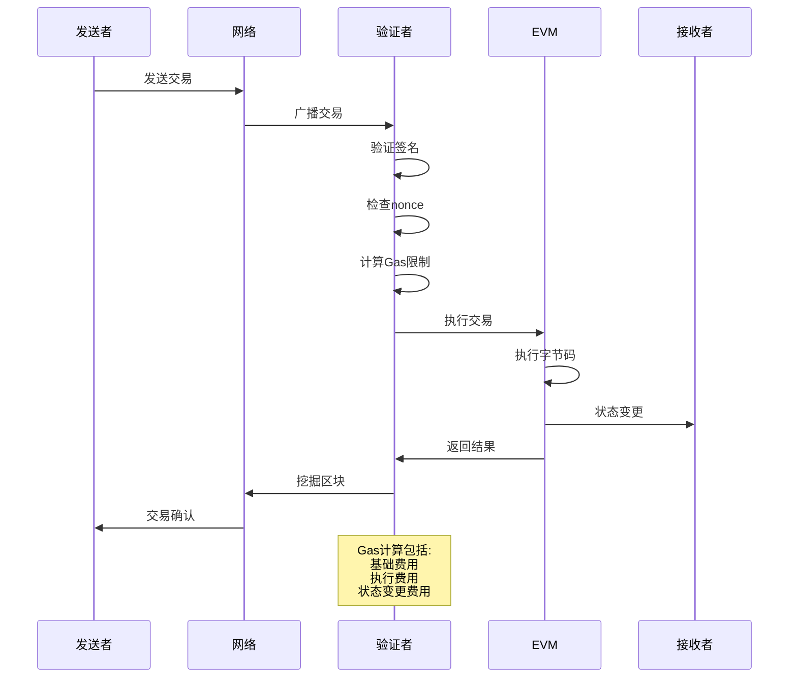

### Gas消耗模型

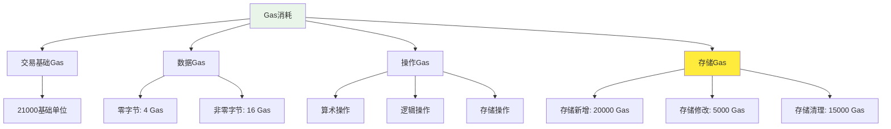

## 账户间交互

### 转账和调用

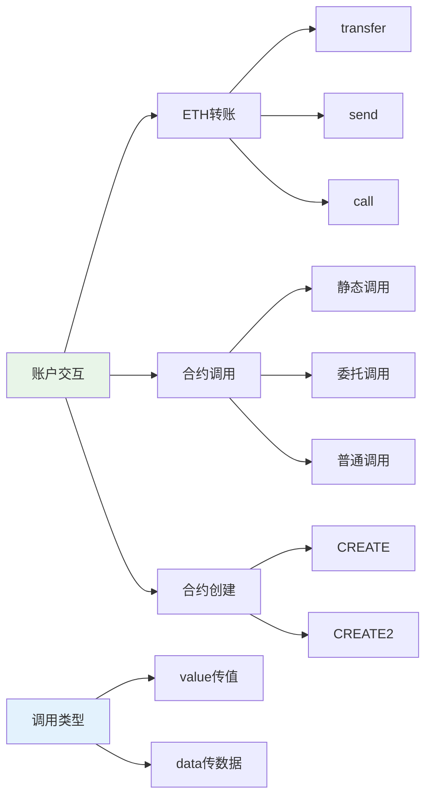

### 委托调用机制

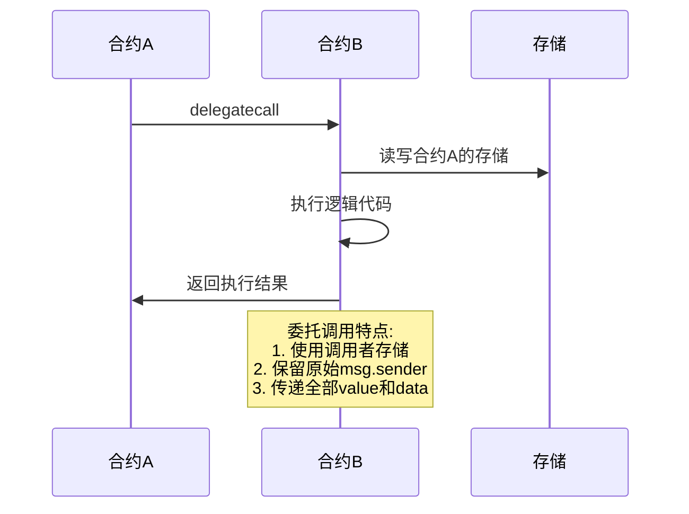

## 安全和权限

### 访问控制模式

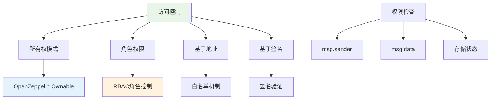

### 重入攻击防护

```mermaid
stateDiagram-v2
    [*] --> 正常状态
    正常状态 --> 函数调用
    函数调用 --> 外部调用
    外部调用 --> 重入检测
    重入检测 --> 已锁定: 重入保护激活
    重入检测 --> 正常执行: 无重入
    已锁定 --> 交易回滚
    正常执行 --> 状态更新
    状态更新 --> 正常状态
    
    note right of 重入检测
        检查重入锁状态<br/>防止恶意递归调用
    end
```

## 账户抽象(EIP-4337)

### 账户抽象架构

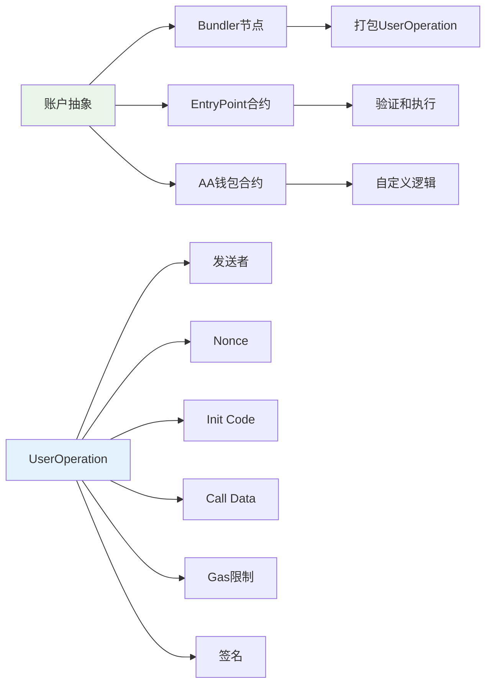

### UserOperation执行流程

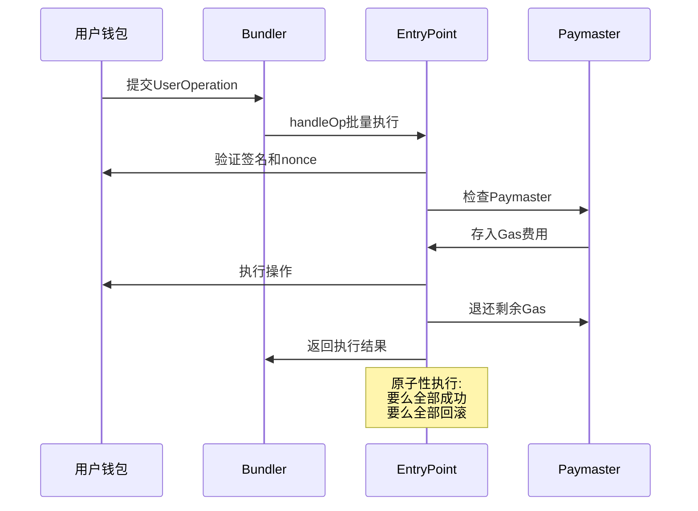

## 性能优化

### 存储优化策略

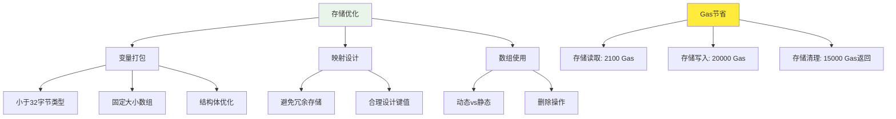

## 总结

EVM账户模型是以太坊区块链的核心架构，理解其工作原理对于智能合约开发至关重要：

### 核心要点

1. **账户类型**：EOA和合约账户有不同的特性和用途
2. **状态管理**：通过Merkle Patricia Trie实现高效的状态存储
3. **Gas机制**：精确的Gas计算模型确保网络资源合理分配
4. **安全性**：完善的权限控制和重入保护机制
5. **未来发展**：账户抽象为用户体验带来革命性改进

### 最佳实践

- 合理设计存储结构以优化Gas消耗
- 实施完善的访问控制和权限管理
- 使用安全的调用模式避免重入攻击
- 关注账户抽象等新特性的发展趋势

随着以太坊生态系统的不断发展，EVM账户模型也在持续演进，为开发者提供更强大、更灵活的构建工具。