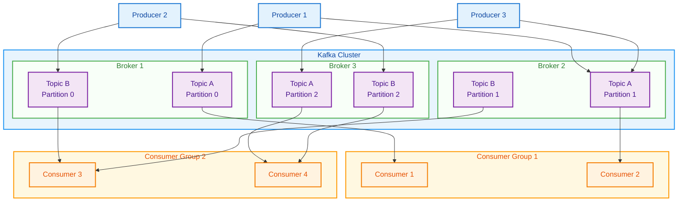
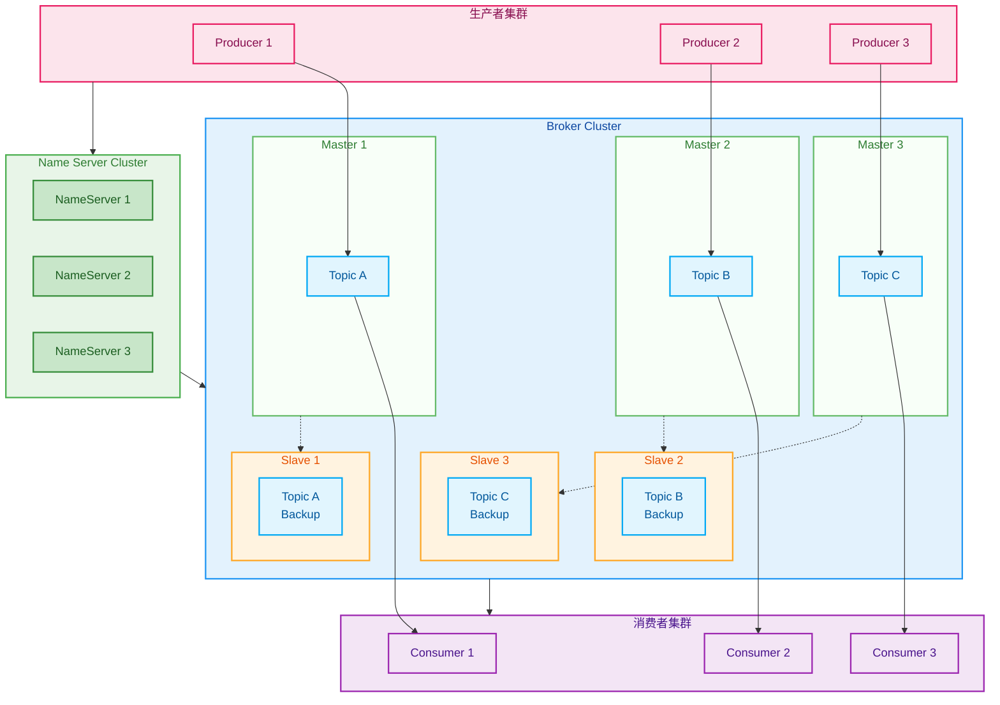
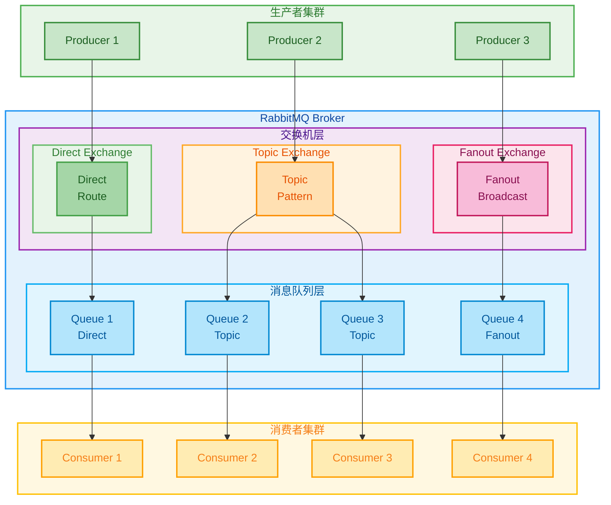
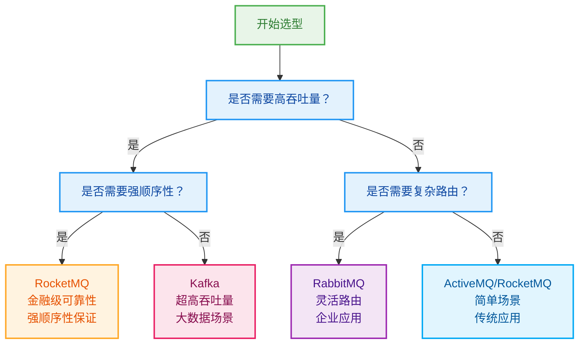

# 热门MQ详解

> 消息队列是分布式系统的重要组件，选择合适的MQ对系统架构至关重要

## 消息队列概述

### 1. 消息队列的作用

```
消息队列核心价值：
├── 解耦
│   ├── 生产者与消费者解耦
│   ├── 业务逻辑与技术实现解耦
│   └── 系统模块间解耦
├── 异步
│   ├── 提升系统响应速度
│   ├── 改善用户体验
│   └── 提高系统吞吐量
├── 削峰
│   ├── 平滑流量峰值
│   ├── 保护后端系统
│   └── 提升系统稳定性
└── 可靠性
    ├── 消息持久化
    ├── 重试机制
    └── 事务支持
```

### 2. 主流MQ对比

| 特性 | Kafka | RocketMQ | RabbitMQ | ActiveMQ |
|------|-------|----------|----------|----------|
| 吞吐量 | 极高 | 高 | 中等 | 中等 |
| 延迟 | 低 | 低 | 低 | 中等 |
| 可靠性 | 高 | 高 | 高 | 中等 |
| 复杂度 | 高 | 中等 | 低 | 低 |
| 生态 | 丰富 | 良好 | 一般 | 一般 |

## Kafka详解

### 1. Kafka架构



### 2. Kafka核心概念

**Partition机制**
```java
// Kafka生产者配置
Properties props = new Properties();
props.put("bootstrap.servers", "localhost:9092");
props.put("key.serializer", "org.apache.kafka.common.serialization.StringSerializer");
props.put("value.serializer", "org.apache.kafka.common.serialization.StringSerializer");

// 创建生产者
KafkaProducer<String, String> producer = new KafkaProducer<>(props);

// 发送消息（指定分区）
ProducerRecord<String, String> record = 
    new ProducerRecord<>("topic-name", 0, "key", "value");

// 自定义分区策略
public class CustomPartitioner implements Partitioner {
    @Override
    public int partition(String topic, Object key, byte[] keyBytes, 
                       Object value, byte[] valueBytes, Cluster cluster) {
        // 自定义分区逻辑
        return Math.abs(key.hashCode()) % cluster.partitionCountForTopic(topic);
    }
}
```

**Consumer Group**
```java
// Kafka消费者配置
Properties props = new Properties();
props.put("bootstrap.servers", "localhost:9092");
props.put("group.id", "consumer-group-1");
props.put("enable.auto.commit", "true");
props.put("auto.commit.interval.ms", "1000");
props.put("key.deserializer", "org.apache.kafka.common.serialization.StringDeserializer");
props.put("value.deserializer", "org.apache.kafka.common.serialization.StringDeserializer");

// 创建消费者
KafkaConsumer<String, String> consumer = new KafkaConsumer<>(props);

// 订阅主题
consumer.subscribe(Arrays.asList("topic-1", "topic-2"));

// 消费消息
while (true) {
    ConsumerRecords<String, String> records = consumer.poll(Duration.ofMillis(100));
    for (ConsumerRecord<String, String> record : records) {
        System.out.printf("offset = %d, key = %s, value = %s%n", 
                         record.offset(), record.key(), record.value());
    }
}
```

### 3. Kafka性能优化

**生产者优化**
```java
// 生产者性能优化配置
props.put("batch.size", 16384);           // 批量大小
props.put("linger.ms", 5);               // 等待时间
props.put("compression.type", "snappy"); // 压缩类型
props.put("acks", "all");                // 确认机制
props.put("retries", 3);                 // 重试次数
props.put("max.in.flight.requests.per.connection", 5);

// 异步发送优化
List<Future<RecordMetadata>> futures = new ArrayList<>();

for (int i = 0; i < 1000; i++) {
    ProducerRecord<String, String> record = 
        new ProducerRecord<>("topic-name", "key-" + i, "value-" + i);
    
    Future<RecordMetadata> future = producer.send(record, (metadata, exception) -> {
        if (exception != null) {
            // 处理发送失败
            exception.printStackTrace();
        }
    });
    
    futures.add(future);
}

// 等待所有消息发送完成
for (Future<RecordMetadata> future : futures) {
    try {
        future.get();
    } catch (Exception e) {
        e.printStackTrace();
    }
}
```

## RocketMQ详解

### 1. RocketMQ架构



### 2. RocketMQ特性

**事务消息**
```java
// 事务消息生产者
TransactionMQProducer producer = new TransactionMQProducer("transaction-producer-group");
producer.setNamesrvAddr("localhost:9876");
producer.setTransactionListener(new TransactionListener() {
    
    @Override
    public LocalTransactionState executeLocalTransaction(Message msg, Object arg) {
        // 执行本地事务
        try {
            // 本地业务逻辑
            boolean success = processLocalTransaction(msg);
            return success ? LocalTransactionState.COMMIT_MESSAGE : 
                           LocalTransactionState.ROLLBACK_MESSAGE;
        } catch (Exception e) {
            return LocalTransactionState.ROLLBACK_MESSAGE;
        }
    }
    
    @Override
    public LocalTransactionState checkLocalTransaction(Message msg) {
        // 检查本地事务状态
        boolean success = checkLocalTransactionStatus(msg);
        return success ? LocalTransactionState.COMMIT_MESSAGE : 
                       LocalTransactionState.ROLLBACK_MESSAGE;
    }
});

// 发送事务消息
Message msg = new Message("topic-name", "tag", "key", "message body".getBytes());
TransactionSendResult result = producer.sendMessageInTransaction(msg, null);
```

**顺序消息**
```java
// 顺序消息生产者
DefaultMQProducer producer = new DefaultMQProducer("order-producer-group");
producer.setNamesrvAddr("localhost:9876");
producer.start();

// 发送顺序消息
for (int i = 0; i < 10; i++) {
    Message msg = new Message("order-topic", "order", 
        ("order-" + i).getBytes());
    
    // 使用相同的orderId作为选择队列的key
    SendResult result = producer.send(msg, new MessageQueueSelector() {
        @Override
        public MessageQueue select(List<MessageQueue> mqs, Message msg, Object arg) {
            String orderId = (String) arg;
            int index = Math.abs(orderId.hashCode()) % mqs.size();
            return mqs.get(index);
        }
    }, "orderId-123");
}

// 顺序消息消费者
DefaultMQPushConsumer consumer = new DefaultMQPushConsumer("order-consumer-group");
consumer.setNamesrvAddr("localhost:9876");
consumer.subscribe("order-topic", "*");
consumer.registerMessageListener(new MessageListenerOrderly() {
    @Override
    public ConsumeOrderlyStatus consumeMessage(
        List<MessageExt> msgs, ConsumeOrderlyContext context) {
        
        for (MessageExt msg : msgs) {
            // 顺序处理消息
            processOrderMessage(msg);
        }
        
        return ConsumeOrderlyStatus.SUCCESS;
    }
});
consumer.start();
```

## RabbitMQ详解

### 1. RabbitMQ架构



### 2. RabbitMQ特性

**交换机类型**
```java
// Direct Exchange（直连交换机）
@Configuration
public class RabbitConfig {
    
    @Bean
    public DirectExchange directExchange() {
        return new DirectExchange("direct.exchange");
    }
    
    @Bean
    public Queue directQueue1() {
        return QueueBuilder.durable("direct.queue.1").build();
    }
    
    @Bean
    public Binding directBinding1() {
        return BindingBuilder.bind(directQueue1())
            .to(directExchange()).with("routing.key.1");
    }
}

// Topic Exchange（主题交换机）
@Bean
public TopicExchange topicExchange() {
    return new TopicExchange("topic.exchange");
}

@Bean
public Queue topicQueue1() {
    return QueueBuilder.durable("topic.queue.1").build();
}

@Bean
public Binding topicBinding1() {
    return BindingBuilder.bind(topicQueue1())
        .to(topicExchange()).with("*.error");
}

// Fanout Exchange（扇出交换机）
@Bean
public FanoutExchange fanoutExchange() {
    return new FanoutExchange("fanout.exchange");
}

@Bean
public Queue fanoutQueue1() {
    return QueueBuilder.durable("fanout.queue.1").build();
}

@Bean
public Binding fanoutBinding1() {
    return BindingBuilder.bind(fanoutQueue1()).to(fanoutExchange());
}
```

**消息确认机制**
```java
// 发送者确认
@Bean
public RabbitTemplate rabbitTemplate(ConnectionFactory connectionFactory) {
    RabbitTemplate template = new RabbitTemplate(connectionFactory);
    template.setConfirmCallback((correlationData, ack, cause) -> {
        if (ack) {
            System.out.println("消息发送成功: " + correlationData.getId());
        } else {
            System.err.println("消息发送失败: " + cause);
        }
    });
    
    template.setReturnCallback((message, replyCode, replyText, exchange, routingKey) -> {
        System.err.println("消息返回: " + message);
    });
    
    return template;
}

// 消费者确认
@RabbitListener(queues = "test.queue")
public void handleMessage(Message message, Channel channel) {
    try {
        // 处理消息
        String content = new String(message.getBody());
        processMessage(content);
        
        // 手动确认
        channel.basicAck(message.getMessageProperties().getDeliveryTag(), false);
    } catch (Exception e) {
        try {
            // 拒绝消息（不重新入队）
            channel.basicNack(message.getMessageProperties().getDeliveryTag(), 
                            false, false);
        } catch (IOException ioException) {
            ioException.printStackTrace();
        }
    }
}
```

## MQ选型指南

### 1. 选型维度

```markmap
# MQ选型

## 性能要求
- 吞吐量
- 延迟
- 并发能力

## 功能需求
- 消息顺序
- 事务消息
- 消息重试
- 死信队列

## 可靠性
- 数据持久化
- 集群支持
- 故障恢复
- 数据备份

## 运维复杂度
- 部署难度
- 监控能力
- 故障排查
- 扩展性

## 生态系统
- 社区活跃度
- 文档完整性
- 工具支持
- 学习成本
```

### 2. 选型决策树



### 3. 最佳实践

**消息设计原则**
```java
// 消息结构设计
public class MessageEntity {
    private String messageId;    // 消息唯一ID
    private String topic;        // 主题
    private String tag;          // 标签
    private String body;         // 消息体
    private Long timestamp;      // 时间戳
    private Integer retryCount;  // 重试次数
    private Map<String, String> properties; // 扩展属性
}

// 消息生产者最佳实践
@Component
public class MessageProducer {
    
    @Autowired
    private KafkaTemplate<String, String> kafkaTemplate;
    
    public void sendMessage(String topic, Object message) {
        try {
            // 构建消息
            MessageEntity entity = new MessageEntity();
            entity.setMessageId(UUID.randomUUID().toString());
            entity.setTopic(topic);
            entity.setBody(JSON.toJSONString(message));
            entity.setTimestamp(System.currentTimeMillis());
            
            // 发送消息
            kafkaTemplate.send(topic, entity.getMessageId(), 
                JSON.toJSONString(entity))
                .addCallback(success -> {
                    // 发送成功回调
                    log.info("消息发送成功: {}", entity.getMessageId());
                }, failure -> {
                    // 发送失败回调
                    log.error("消息发送失败: {}", entity.getMessageId(), failure);
                    // 重试或补偿
                });
        } catch (Exception e) {
            log.error("发送消息异常", e);
        }
    }
}
```

## 总结

消息队列选型是一个重要的架构决策，需要综合考虑：

1. **Kafka**：适合大数据场景，吞吐量极高，延迟较低
2. **RocketMQ**：适合金融场景，可靠性高，功能丰富
3. **RabbitMQ**：适合企业应用，路由灵活，易于使用
4. **ActiveMQ**：适合传统应用，成熟稳定，学习成本低

选择MQ时，应该根据具体的业务需求、技术团队熟悉程度和运维能力来决定。没有最好的MQ，只有最适合的MQ。