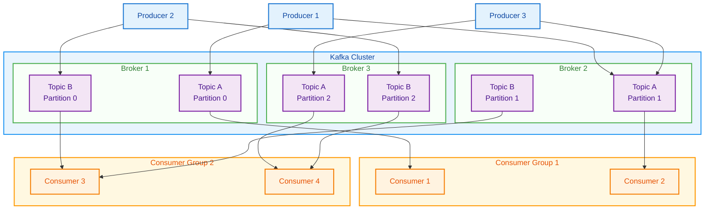
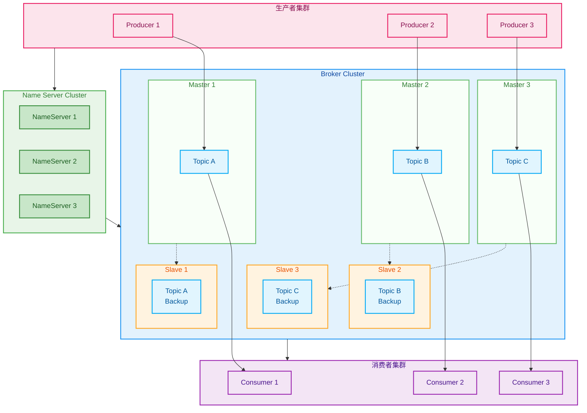
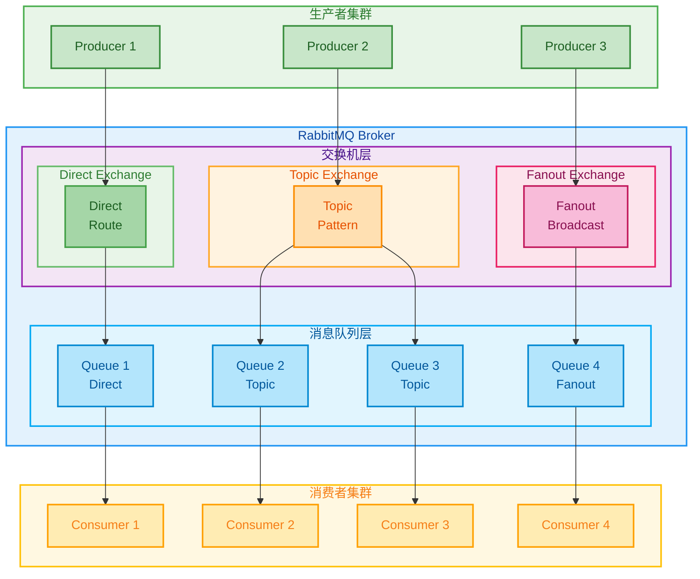
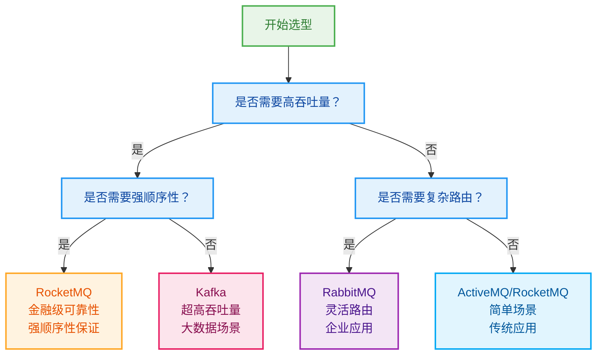

# 热门MQ详解

> 消息队列是分布式系统的重要组件，选择合适的MQ对系统架构至关重要

## 消息队列概述

### 1. 消息队列的作用

```
消息队列核心价值：
├── 解耦
│   ├── 生产者与消费者解耦
│   ├── 业务逻辑与技术实现解耦
│   └── 系统模块间解耦
├── 异步
│   ├── 提升系统响应速度
│   ├── 改善用户体验
│   └── 提高系统吞吐量
├── 削峰
│   ├── 平滑流量峰值
│   ├── 保护后端系统
│   └── 提升系统稳定性
└── 可靠性
    ├── 消息持久化
    ├── 重试机制
    └── 事务支持
```

### 2. 主流MQ对比

| 特性 | Kafka | RocketMQ | RabbitMQ | ActiveMQ |
|------|-------|----------|----------|----------|
| 吞吐量 | 极高 | 高 | 中等 | 中等 |
| 延迟 | 低 | 低 | 低 | 中等 |
| 可靠性 | 高 | 高 | 高 | 中等 |
| 复杂度 | 高 | 中等 | 低 | 低 |
| 生态 | 丰富 | 良好 | 一般 | 一般 |

## Kafka详解

### 1. Kafka架构



### 2. Kafka核心概念

Kafka的核心设计理念在于其分布式的日志存储机制，通过Partition机制实现了高吞吐量的消息处理。每个Topic可以被分为多个Partition，分布在不同Broker上，从而实现水平扩展。

**Partition机制**

Partition是Kafka实现高吞吐量的关键设计。每个Partition都是一个有序的、不可变的消息序列，消息按照追加的方式写入。通过合理设计分区策略，可以实现负载均衡和顺序消息保证。

```java
// Kafka生产者配置 - 详细解释每个参数的作用
Properties props = new Properties();
props.put("bootstrap.servers", "localhost:9092"); // Kafka集群地址，多个地址用逗号分隔
props.put("key.serializer", "org.apache.kafka.common.serialization.StringSerializer"); // 消息键序列化器
props.put("value.serializer", "org.apache.kafka.common.serialization.StringSerializer"); // 消息值序列化器

// 创建生产者实例
KafkaProducer<String, String> producer = new KafkaProducer<>(props);

// 发送消息到指定分区 - 这确保了消息的确定性分布
ProducerRecord<String, String> record =
    new ProducerRecord<>("topic-name", 0, "key", "value"); // 参数：主题、分区号、键、值

// 自定义分区策略 - 基于业务逻辑实现消息的智能分布
public class CustomPartitioner implements Partitioner {
    @Override
    public int partition(String topic, Object key, byte[] keyBytes,
                       Object value, byte[] valueBytes, Cluster cluster) {
        // 这里可以根据业务需求实现不同的分区策略：
        // 1. 基于用户ID的均匀分布
        // 2. 基于地理区域的就近分布
        // 3. 基于业务类型的相关性分布
        return Math.abs(key.hashCode()) % cluster.partitionCountForTopic(topic);
    }
}
```

分区策略的选择直接影响系统的性能和消息处理的特性。常见的分区策略包括：
- **轮询分区**：消息均匀分布到所有分区，保证负载均衡
- **键分区**：相同键的消息总是发送到同一分区，保证消息顺序
- **自定义分区**：根据业务逻辑实现特定的分布规则

**Consumer Group机制**

Consumer Group是Kafka实现消息消费负载均衡和容错的核心机制。一个Consumer Group包含多个消费者，它们共同消费一个或多个Topic的消息。Kafka通过Rebalance机制自动分配分区给消费者，确保每个分区只被组内的一个消费者消费。

```java
// Kafka消费者配置 - 详细解释消费者组的配置参数
Properties props = new Properties();
props.put("bootstrap.servers", "localhost:9092"); // Kafka集群地址
props.put("group.id", "consumer-group-1"); // 消费者组ID，相同组的消费者会分担负载
props.put("enable.auto.commit", "true"); // 是否自动提交偏移量
props.put("auto.commit.interval.ms", "1000"); // 自动提交偏移量的时间间隔（毫秒）
props.put("key.deserializer", "org.apache.kafka.common.serialization.StringDeserializer"); // 键反序列化器
props.put("value.deserializer", "org.apache.kafka.common.serialization.StringDeserializer"); // 值反序列化器

// 创建消费者实例
KafkaConsumer<String, String> consumer = new KafkaConsumer<>(props);

// 订阅主题 - 消费者可以订阅多个主题
consumer.subscribe(Arrays.asList("topic-1", "topic-2"));

// 消费消息的典型模式
while (true) {
    // poll()方法会拉取分配给该消费者的分区中的消息
    // Duration.ofMillis(100)指定了最长等待时间
    ConsumerRecords<String, String> records = consumer.poll(Duration.ofMillis(100));

    for (ConsumerRecord<String, String> record : records) {
        // 每条消息包含丰富的元数据信息
        System.out.printf("主题: %s, 分区: %d, 偏移量: %d, 键: %s, 值: %s%n",
                         record.topic(), record.partition(),
                         record.offset(), record.key(), record.value());
    }

    // 如果设置enable.auto.commit=false，需要手动提交偏移量
    // consumer.commitSync();
}
```

消费者组的重要特性：

1. **负载均衡**：同一个消费者组内的多个消费者会自动分担不同分区的消费任务
2. **容错性**：如果某个消费者宕机，Kafka会自动将其负责的分区重新分配给其他健康的消费者
3. **消息处理保证**：每个分区只会被组内的一个消费者处理，避免了重复消费
4. **可扩展性**：可以动态增加或减少消费者数量，Kafka会自动重新平衡分区分配

**偏移量管理**是消费者组的关键概念。Kafka通过偏移量来跟踪消费者在每个分区中的消费进度：
- **自动提交**：定期自动提交偏移量，简单但可能导致消息重复或丢失
- **手动提交**：在消息处理完成后手动提交，更精确但需要额外处理
- **重置策略**：可以指定从最早、最新或特定偏移量开始消费

### 3. Kafka性能优化

Kafka的性能优化是一个系统性的工作，需要在生产者、消费者和Broker端进行全面调优。合理的配置可以显著提升吞吐量、降低延迟，并提高系统的稳定性。

**生产者性能优化**

生产者端的优化主要关注如何提高消息发送的吞吐量和效率。通过合理配置批量发送、压缩和异步处理等参数，可以实现显著的性能提升。

```java
// 生产者性能优化配置 - 每个参数都有明确的性能影响
props.put("batch.size", 16384);           // 批量大小（字节），影响吞吐量
                                        // 较大的批次可以提高吞吐量但会增加延迟
props.put("linger.ms", 5);               // 等待时间（毫秒），控制批次的等待时间
                                        // 允许生产者等待更长时间以收集更多消息
props.put("compression.type", "snappy"); // 压缩类型，减少网络传输
                                        // 可选：none, gzip, snappy, lz4, zstd
props.put("acks", "all");                // 确认机制，保证消息可靠性
                                        // 0: 不等待确认，1: 等待leader确认，all: 等待所有副本确认
props.put("retries", 3);                 // 重试次数，提高发送可靠性
props.put("max.in.flight.requests.per.connection", 5); // 连接上允许的未确认请求数
                                                        // 提高并发度但可能影响顺序性

// 异步发送优化 - 充分利用网络和CPU资源
List<Future<RecordMetadata>> futures = new ArrayList<>();

// 批量发送消息，利用异步回调机制处理结果
for (int i = 0; i < 1000; i++) {
    ProducerRecord<String, String> record =
        new ProducerRecord<>("topic-name", "key-" + i, "value-" + i);

    // 异步发送消息，通过回调函数处理发送结果
    Future<RecordMetadata> future = producer.send(record, (metadata, exception) -> {
        if (exception != null) {
            // 处理发送失败的情况
            // 可以实现重试逻辑、错误日志记录或告警机制
            System.err.println("消息发送失败: " + exception.getMessage());
            exception.printStackTrace();
        } else {
            // 发送成功的回调，可以记录性能指标
            System.out.printf("消息发送成功 - 主题: %s, 分区: %d, 偏移量: %d%n",
                             metadata.topic(), metadata.partition(), metadata.offset());
        }
    });

    futures.add(future);
}

// 等待所有消息发送完成 - 确保在程序退出前所有消息都已发送
for (Future<RecordMetadata> future : futures) {
    try {
        // get()方法会阻塞直到消息发送完成
        RecordMetadata metadata = future.get();
        System.out.println("所有消息发送完成");
    } catch (InterruptedException e) {
        Thread.currentThread().interrupt();
        System.err.println("发送被中断: " + e.getMessage());
    } catch (ExecutionException e) {
        System.err.println("发送执行异常: " + e.getCause());
    }
}
```

**关键性能调优策略：**

1. **批量发送优化**：
   - `batch.size`控制每批消息的大小，通常设置为16KB-1MB
   - `linger.ms`设置等待时间，平衡延迟和吞吐量
   - 监控批次大小和发送频率，根据业务场景调整

2. **压缩策略选择**：
   - **Snappy**：平衡压缩率和CPU消耗，适合大多数场景
   - **LZ4**：压缩速度最快，适合CPU受限场景
   - **ZSTD**：压缩率最高，适合网络带宽受限场景
   - **Gzip**：兼容性好但性能较差

3. **可靠性配置**：
   - `acks=all`提供最高可靠性，但会影响性能
   - 根据业务重要性选择合适的确认级别
   - 合理设置重试策略和超时时间

4. **内存和网络调优**：
   - 调整`buffer.memory`控制生产者内存使用
   - 设置合适的连接池大小
   - 启用TCP_NODELAY减少网络延迟

## RocketMQ详解

### 1. RocketMQ架构



### 2. RocketMQ特性

RocketMQ作为阿里巴巴开源的消息中间件，在金融级应用场景中表现突出。其核心特性包括事务消息、顺序消息、延迟消息等，为企业级应用提供了完整的消息解决方案。

**事务消息机制**

事务消息是RocketMQ的核心特性之一，它解决了分布式事务的难题，确保消息发送与本地事务的原子性。这在金融交易、订单处理等对数据一致性要求极高的场景中尤为重要。

```java
// 事务消息生产者配置 - 实现分布式事务的最终一致性
TransactionMQProducer producer = new TransactionMQProducer("transaction-producer-group");
producer.setNamesrvAddr("localhost:9876");

// 设置事务监听器 - 处理本地事务执行和状态检查
producer.setTransactionListener(new TransactionListener() {

    @Override
    public LocalTransactionState executeLocalTransaction(Message msg, Object arg) {
        // 执行本地事务 - 这是事务消息的核心步骤
        try {
            // 本地业务逻辑，例如：数据库操作、文件写入等
            boolean success = processLocalTransaction(msg);

            if (success) {
                // 本地事务成功，提交消息，消费者可见
                return LocalTransactionState.COMMIT_MESSAGE;
            } else {
                // 本地事务失败，回滚消息，消费者不可见
                return LocalTransactionState.ROLLBACK_MESSAGE;
            }
        } catch (Exception e) {
            // 异常情况下回滚消息
            return LocalTransactionState.ROLLBACK_MESSAGE;
        }
    }

    @Override
    public LocalTransactionState checkLocalTransaction(Message msg) {
        // 检查本地事务状态 - 用于异常情况的最终确认
        // 当本地事务执行状态未知时，Broker会回调此方法

        try {
            // 根据消息ID或其他标识查询本地事务状态
            boolean success = checkLocalTransactionStatus(msg);

            if (success) {
                return LocalTransactionState.COMMIT_MESSAGE;
            } else {
                return LocalTransactionState.ROLLBACK_MESSAGE;
            }
        } catch (Exception e) {
            // 状态检查失败，继续等待下次检查
            return LocalTransactionState.UNKNOW;
        }
    }
});

// 发送事务消息的完整流程
Message msg = new Message("topic-name", "tag", "key", "message body".getBytes());
TransactionSendResult result = producer.sendMessageInTransaction(msg, null);

// 事务消息的执行过程：
// 1. 发送半消息（Half Message）- 消息对消费者不可见
// 2. 执行本地事务
// 3. 根据本地事务结果提交或回滚消息
// 4. 如果状态未知，Broker会定期回调检查本地事务状态
```

事务消息的关键特性：

1. **两阶段提交**：
   - **阶段一**：发送半消息，消息暂时不可见
   - **阶段二**：根据本地事务结果提交或回滚

2. **状态回查机制**：
   - 当本地事务状态未知时，Broker会定期回查
   - 确保分布式事务的最终一致性

3. **应用场景**：
   - **支付系统**：确保订单创建与支付通知的一致性
   - **库存系统**：保证库存扣减与订单创建的原子性
   - **积分系统**：确保积分变动与业务操作的同步

**事务消息的最佳实践：**

1. **幂等性设计**：本地事务需要支持重复执行
2. **状态查询**：实现可靠的事务状态查询机制
3. **异常处理**：合理处理网络异常和超时情况
4. **监控告警**：监控事务消息的成功率和延迟

**顺序消息机制**

顺序消息是RocketMQ的另一个重要特性，它确保了相同业务标识的消息能够按照发送顺序被消费。在电商订单、金融交易等场景中，消息的顺序性对业务逻辑的正确性至关重要。

```java
// 顺序消息生产者配置 - 确保消息的顺序性
DefaultMQProducer producer = new DefaultMQProducer("order-producer-group");
producer.setNamesrvAddr("localhost:9876");
producer.start();

// 发送顺序消息的核心逻辑
for (int i = 0; i < 10; i++) {
    Message msg = new Message("order-topic", "order",
        ("order-" + i).getBytes());

    // 使用相同的orderId作为选择队列的key
    // 这是保证消息顺序性的关键：相同orderId的消息会发送到同一个队列
    SendResult result = producer.send(msg, new MessageQueueSelector() {
        @Override
        public MessageQueue select(List<MessageQueue> mqs, Message msg, Object arg) {
            String orderId = (String) arg;
            // 通过哈希算法确保相同orderId的消息路由到同一个队列
            int index = Math.abs(orderId.hashCode()) % mqs.size();
            return mqs.get(index);
        }
    }, "orderId-123"); // 关键：所有相关消息使用相同的orderId
}

// 顺序消息消费者配置 - 单线程顺序处理
DefaultMQPushConsumer consumer = new DefaultMQPushConsumer("order-consumer-group");
consumer.setNamesrvAddr("localhost:9876");
consumer.subscribe("order-topic", "*");

// 注册顺序消息监听器
consumer.registerMessageListener(new MessageListenerOrderly() {
    @Override
    public ConsumeOrderlyStatus consumeMessage(
        List<MessageExt> msgs, ConsumeOrderlyContext context) {

        try {
            // 顺序处理消息 - 同一队列的消息会按顺序被同一线程处理
            for (MessageExt msg : msgs) {
                // 业务处理逻辑，例如：订单状态更新
                processOrderMessage(msg);
                System.out.println("处理消息: " + new String(msg.getBody()));
            }

            // 返回成功状态
            return ConsumeOrderlyStatus.SUCCESS;
        } catch (Exception e) {
            // 处理失败，稍后重试
            System.err.println("消息处理失败: " + e.getMessage());
            return ConsumeOrderlyStatus.SUSPEND_CURRENT_QUEUE_A_MOMENT;
        }
    }
});
consumer.start();

// 顺序消息的处理流程：
// 1. 生产者使用MessageQueueSelector将相关消息路由到同一队列
// 2. 消费者为每个队列分配一个消费线程
// 3. 队列内的消息严格按照FIFO顺序处理
// 4. 处理失败时暂停该队列，其他队列继续正常处理
```

顺序消息的关键特性：

1. **分区顺序性**：
   - 相同业务键的消息发送到同一个队列
   - 队列内部保证严格的消息顺序
   - 不同队列之间可以并行处理

2. **消费保证**：
   - 每个队列只有一个消费者线程
   - 前一条消息处理完成前，不会处理下一条
   - 处理失败时暂停该队列，不影响其他队列

3. **应用场景**：
   - **电商订单**：订单创建、支付、发货的状态变更
   - **金融交易**：交易申请、审核、执行的流程控制
   - **物流跟踪**：揽收、运输、派送的节点更新

**顺序消息的设计原则：**

1. **业务键选择**：选择能代表业务流程唯一性的字段作为路由键
2. **异常处理**：实现合理的重试和补偿机制
3. **性能权衡**：顺序性会影响并发度，需要权衡业务需求
4. **监控指标**：监控消息处理延迟和队列堆积情况

## RabbitMQ详解

### 1. RabbitMQ架构



### 2. RabbitMQ特性

RabbitMQ以其灵活的路由机制和丰富的交换机类型而著称，为企业级应用提供了强大的消息路由能力。通过合理设计交换机和队列的绑定关系，可以实现复杂的消息分发策略。

**交换机类型详解**

RabbitMQ的核心在于其交换机机制，不同的交换机类型适用于不同的业务场景。理解交换机的工作原理对于设计高效的消息系统至关重要。

```java
// Direct Exchange（直连交换机）- 精确匹配路由
@Configuration
public class RabbitConfig {

    @Bean
    public DirectExchange directExchange() {
        return new DirectExchange("direct.exchange"); // 创建直连交换机
    }

    @Bean
    public Queue directQueue1() {
        return QueueBuilder.durable("direct.queue.1").build(); // 创建持久化队列
    }

    @Bean
    public Binding directBinding1() {
        return BindingBuilder.bind(directQueue1())
            .to(directExchange()).with("routing.key.1"); // 精确匹配路由键
    }

    // Direct Exchange特点：
    // - 路由键必须完全匹配才会转发消息
    // - 适用于点对点的消息传递
    // - 常用于任务分发和特定消费者接收特定消息
}

// Topic Exchange（主题交换机）- 模式匹配路由
@Bean
public TopicExchange topicExchange() {
    return new TopicExchange("topic.exchange");
}

@Bean
public Queue topicQueue1() {
    return QueueBuilder.durable("topic.queue.1").build();
}

@Bean
public Binding topicBinding1() {
    return BindingBuilder.bind(topicQueue1())
        .to(topicExchange()).with("*.error"); // 通配符匹配
}

// Topic Exchange的通配符规则：
// * (星号) - 匹配一个单词，如 "order.error" 匹配 "*.error"
// # (井号) - 匹配零个或多个单词，如 "order.payment.error" 匹配 "order.#"

// Topic Exchange应用场景：
// - 日志系统：按级别和模块路由日志消息
// - 监控系统：根据事件类型和严重程度分发告警
// - 内容分发：根据内容和类型路由到不同处理器

// Fanout Exchange（扇出交换机） - 广播路由
@Bean
public FanoutExchange fanoutExchange() {
    return new FanoutExchange("fanout.exchange");
}

@Bean
public Queue fanoutQueue1() {
    return QueueBuilder.durable("fanout.queue.1").build();
}

@Bean
public Binding fanoutBinding1() {
    return BindingBuilder.bind(fanoutQueue1()).to(fanoutExchange()); // 忽略路由键
}

// Fanout Exchange特点：
// - 忽略路由键，将消息广播到所有绑定的队列
    // - 适用于消息广播场景
    // - 常用于事件通知、状态更新等一对多通信
}
```

**交换机选择指南：**

1. **Direct Exchange**：
   - **适用场景**：需要精确路由的消息传递
   - **优势**：简单直接，性能高效
   - **典型应用**：任务队列、点对点通信

2. **Topic Exchange**：
   - **适用场景**：需要基于模式的灵活路由
   - **优势**：路由策略灵活，支持复杂匹配
   - **典型应用**：日志系统、事件分发、内容分类

3. **Fanout Exchange**：
   - **适用场景**：需要广播消息给多个消费者
   - **优势**：简单高效，支持一对多通信
   - **典型应用**：事件通知、状态广播、新闻推送

**高级路由策略：**

1. **多重绑定**：一个队列可以绑定多个路由键
2. **交换机级联**：交换机可以绑定到其他交换机
3. **死信交换机**：处理无法正常消费的消息
4. **备用交换机**：处理没有匹配路由的消息

**消息确认机制**

消息确认机制是RabbitMQ保证消息可靠传递的关键特性。通过发送者确认和消费者确认两个层面的机制，确保消息不会因为网络问题或处理异常而丢失。

```java
// 发送者确认机制 - 确保消息成功到达交换机
@Bean
public RabbitTemplate rabbitTemplate(ConnectionFactory connectionFactory) {
    RabbitTemplate template = new RabbitTemplate(connectionFactory);

    // 设置确认回调 - 消息是否成功到达交换机
    template.setConfirmCallback((correlationData, ack, cause) -> {
        if (ack) {
            // 消息成功到达交换机
            System.out.println("消息发送成功: " + correlationData.getId());
            // 可以在这里更新发送状态、记录日志等
        } else {
            // 消息未能到达交换机，需要处理失败情况
            System.err.println("消息发送失败: " + cause);
            // 可以实现重试机制、发送告警等
        }
    });

    // 设置返回回调 - 消息到达交换机但无法路由到队列
    template.setReturnCallback((message, replyCode, replyText, exchange, routingKey) -> {
        System.err.println("消息返回 - 交换机: " + exchange +
                         ", 路由键: " + routingKey +
                         ", 回复码: " + replyCode +
                         ", 回复文本: " + replyText);
        // 可以将消息发送到死信队列或记录错误日志
    });

    // 启用发送者确认模式
    template.setMandatory(true); // 启用消息返回机制

    return template;
}

// 消费者确认机制 - 确保消息被正确处理
@RabbitListener(queues = "test.queue")
public void handleMessage(Message message, Channel channel) {
    try {
        // 获取消息属性和处理消息
        String content = new String(message.getBody());
        long deliveryTag = message.getMessageProperties().getDeliveryTag();

        // 处理消息的业务逻辑
        processMessage(content);

        // 手动确认消息 - 告诉RabbitMQ消息已成功处理
        // 参数1: 消息的deliveryTag
        // 参数2: 是否批量确认（false表示只确认当前消息）
        channel.basicAck(deliveryTag, false);

        System.out.println("消息处理成功: " + deliveryTag);

    } catch (BusinessException e) {
        // 业务异常，拒绝消息并重新入队（可以重试）
        try {
            long deliveryTag = message.getMessageProperties().getDeliveryTag();
            // basicNack参数：deliveryTag, 是否批量, 是否重新入队
            channel.basicNack(deliveryTag, false, true);
            System.err.println("业务异常，消息重新入队: " + e.getMessage());
        } catch (IOException ioException) {
            System.err.println("确认异常: " + ioException.getMessage());
        }
    } catch (Exception e) {
        // 系统异常，拒绝消息且不重新入队（发送到死信队列）
        try {
            long deliveryTag = message.getMessageProperties().getDeliveryTag();
            channel.basicNack(deliveryTag, false, false);
            System.err.println("系统异常，消息丢弃: " + e.getMessage());
        } catch (IOException ioException) {
            System.err.println("确认异常: " + ioException.getMessage());
        }
    }
}

// 消费者确认模式配置
@Bean
public SimpleRabbitListenerContainerFactory rabbitListenerContainerFactory(
        ConnectionFactory connectionFactory) {
    SimpleRabbitListenerContainerFactory factory = new SimpleRabbitListenerContainerFactory();
    factory.setConnectionFactory(connectionFactory);

    // 设置消费者确认模式为手动
    factory.setAcknowledgeMode(AcknowledgeMode.MANUAL);

    // 设置并发消费者数量
    factory.setConcurrentConsumers(3);
    factory.setMaxConcurrentConsumers(10);

    // 设置预取数量
    factory.setPrefetchCount(5);

    return factory;
}
```

**消息确认的关键概念：**

1. **发送者确认（Publisher Confirms）**：
   - **Confirm回调**：确认消息是否到达交换机
   - **Return回调**：处理无法路由的消息
   - **Mandatory标志**：控制消息返回行为

2. **消费者确认（Consumer Acknowledgements）**：
   - **自动确认**：消息发送后立即确认，可能丢失
   - **手动确认**：处理完成后手动确认，更可靠
   - **拒绝机制**：处理失败时的拒绝策略

3. **确认模式选择**：
   - **basicAck**：确认消息处理成功
   - **basicNack**：拒绝消息，可选择重新入队
   - **basicReject**：拒绝单条消息，效果类似basicNack

**可靠性保证的最佳实践：**

1. **持久化配置**：队列、交换机、消息都设置为持久化
2. **重试机制**：实现合理的重试策略和退避算法
3. **死信队列**：处理无法正常消费的消息
4. **监控告警**：监控消息堆积和处理异常

## MQ选型指南

### 1. 选型维度

```markmap
# MQ选型

## 性能要求
- 吞吐量
- 延迟
- 并发能力

## 功能需求
- 消息顺序
- 事务消息
- 消息重试
- 死信队列

## 可靠性
- 数据持久化
- 集群支持
- 故障恢复
- 数据备份

## 运维复杂度
- 部署难度
- 监控能力
- 故障排查
- 扩展性

## 生态系统
- 社区活跃度
- 文档完整性
- 工具支持
- 学习成本
```

### 2. 选型决策树



### 3. 最佳实践

消息队列的最佳实践涉及从消息设计到系统架构的各个方面。遵循这些原则可以构建出高性能、高可靠、易维护的消息系统。

**消息设计原则**

良好的消息设计是构建可靠消息系统的基础。消息结构不仅要满足当前业务需求，还要考虑系统的扩展性、可维护性和监控能力。

```java
// 消息结构设计 - 包含完整的元数据和扩展信息
public class MessageEntity {
    private String messageId;        // 消息唯一ID - 用于追踪和去重
    private String topic;            // 主题 - 消息分类
    private String tag;              // 标签 - 进一步分类或路由
    private String body;             // 消息体 - 实际业务数据
    private Long timestamp;          // 时间戳 - 消息创建时间
    private Integer retryCount;      // 重试次数 - 失败重试控制
    private String sourceSystem;     // 来源系统 - 便于追踪
    private String targetSystem;     // 目标系统 - 消息处理方
    private Integer priority;        // 优先级 - 消息处理优先级
    private Long expireTime;         // 过期时间 - 防止消息积压
    private Map<String, String> properties; // 扩展属性 - 灵活扩展
    private String traceId;          // 链路追踪ID - 分布式追踪

    // 构造函数、getter、setter方法...
}

// 消息生产者最佳实践 - 企业级消息发送实现
@Component
@Slf4j
public class MessageProducer {

    @Autowired
    private KafkaTemplate<String, String> kafkaTemplate;

    @Autowired
    private MessageTracer messageTracer; // 消息追踪器

    @Value("${app.message.max.retry:3}")
    private Integer maxRetryCount; // 最大重试次数配置

    public void sendMessage(String topic, Object message) {
        sendMessage(topic, message, null);
    }

    public void sendMessage(String topic, Object message, String tag) {
        try {
            // 1. 构建标准化的消息实体
            MessageEntity entity = buildMessageEntity(topic, message, tag);

            // 2. 消息预处理和验证
            validateMessage(entity);

            // 3. 记录消息发送开始事件
            messageTracer.traceSendStart(entity.getMessageId(), topic);

            // 4. 异步发送消息
            ListenableFuture<SendResult<String, String>> future = kafkaTemplate.send(
                topic,
                entity.getMessageId(),
                JSON.toJSONString(entity)
            );

            // 5. 设置发送结果回调
            future.addCallback(
                success -> {
                    // 发送成功处理
                    handleSendSuccess(entity, success);
                },
                failure -> {
                    // 发送失败处理
                    handleSendFailure(entity, failure);
                }
            );

        } catch (Exception e) {
            // 异常处理
            log.error("发送消息异常 - 主题: {}, 消息: {}", topic, message, e);

            // 发送告警
            alertService.sendAlert("消息发送异常", e.getMessage());

            // 记录异常指标
            metricsCollector.incrementCounter("message.send.error",
                Tags.of("topic", topic, "error", e.getClass().getSimpleName()));
        }
    }

    private MessageEntity buildMessageEntity(String topic, Object message, String tag) {
        MessageEntity entity = new MessageEntity();

        // 基础信息
        entity.setMessageId(UUID.randomUUID().toString());
        entity.setTopic(topic);
        entity.setTag(tag);
        entity.setBody(JSON.toJSONString(message));
        entity.setTimestamp(System.currentTimeMillis());
        entity.setRetryCount(0);

        // 系统信息
        entity.setSourceSystem(getCurrentSystemName());
        entity.setTargetSystem(getTargetSystemByTopic(topic));

        // 业务信息
        entity.setPriority(calculatePriority(message));
        entity.setExpireTime(calculateExpireTime(message));

        // 扩展属性
        Map<String, String> properties = new HashMap<>();
        properties.put("contentType", "application/json");
        properties.put("version", "1.0");
        entity.setProperties(properties);

        // 链路追踪
        entity.setTraceId(MDC.get("traceId"));

        return entity;
    }

    private void validateMessage(MessageEntity entity) {
        // 消息完整性验证
        if (StringUtils.isEmpty(entity.getMessageId())) {
            throw new IllegalArgumentException("消息ID不能为空");
        }

        if (StringUtils.isEmpty(entity.getTopic())) {
            throw new IllegalArgumentException("消息主题不能为空");
        }

        // 消息大小验证
        int messageSize = JSON.toJSONString(entity).getBytes().length;
        if (messageSize > getMaxMessageSize()) {
            throw new IllegalArgumentException("消息大小超限: " + messageSize);
        }

        // 业务规则验证
        validateBusinessRules(entity);
    }

    private void handleSendSuccess(MessageEntity entity, SendResult<String, String> result) {
        log.info("消息发送成功 - ID: {}, 主题: {}, 分区: {}, 偏移量: {}",
                entity.getMessageId(),
                entity.getTopic(),
                result.getRecordMetadata().partition(),
                result.getRecordMetadata().offset());

        // 记录成功指标
        metricsCollector.incrementCounter("message.send.success",
            Tags.of("topic", entity.getTopic()));

        // 完成链路追踪
        messageTracer.traceSendSuccess(entity.getMessageId());

        // 发送成功事件（可选）
        eventPublisher.publishEvent(new MessageSendSuccessEvent(entity));
    }

    private void handleSendFailure(MessageEntity entity, Throwable failure) {
        log.error("消息发送失败 - ID: {}, 主题: {}, 重试次数: {}",
                entity.getMessageId(),
                entity.getTopic(),
                entity.getRetryCount(),
                failure);

        // 重试逻辑
        if (entity.getRetryCount() < maxRetryCount) {
            entity.setRetryCount(entity.getRetryCount() + 1);

            // 延迟重试
            scheduler.schedule(() -> sendMessage(entity),
                calculateRetryDelay(entity.getRetryCount()), TimeUnit.MILLISECONDS);
        } else {
            // 重试次数超限，发送到死信队列或记录到数据库
            deadLetterHandler.handleDeadLetter(entity, failure);

            // 发送告警
            alertService.sendAlert("消息发送失败",
                String.format("消息ID: %s, 失败原因: %s",
                    entity.getMessageId(), failure.getMessage()));
        }

        // 记录失败指标
        metricsCollector.incrementCounter("message.send.failure",
            Tags.of("topic", entity.getTopic(), "error", failure.getClass().getSimpleName()));
    }
}
```

**消息系统的关键设计原则：**

1. **消息幂等性**：
   - 每条消息都有唯一ID
   - 消费者实现幂等处理逻辑
   - 使用Redis或数据库记录已处理消息

2. **消息追踪**：
   - 完整的链路追踪机制
   - 记录消息的完整生命周期
   - 便于问题排查和性能分析

3. **异常处理**：
   - 多层次的重试机制
   - 死信队列处理失败消息
   - 完善的告警和监控体系

4. **性能优化**：
   - 批量发送和消费
   - 合理的分区和队列设计
   - 压缩和序列化优化

5. **可扩展性**：
   - 消息版本兼容性设计
   - 灵活的扩展属性机制
   - 支持多种序列化格式

## 总结

消息队列选型是一个重要的架构决策，需要综合考虑：

1. **Kafka**：适合大数据场景，吞吐量极高，延迟较低
2. **RocketMQ**：适合金融场景，可靠性高，功能丰富
3. **RabbitMQ**：适合企业应用，路由灵活，易于使用
4. **ActiveMQ**：适合传统应用，成熟稳定，学习成本低

选择MQ时，应该根据具体的业务需求、技术团队熟悉程度和运维能力来决定。没有最好的MQ，只有最适合的MQ。