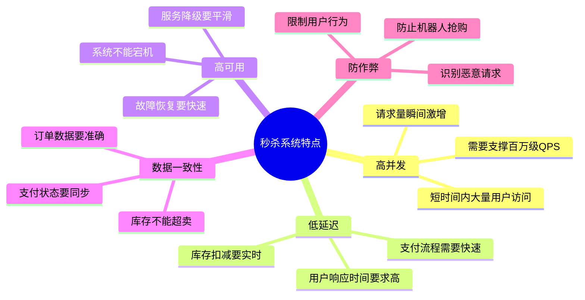
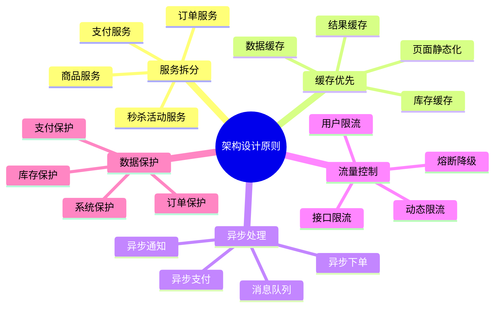
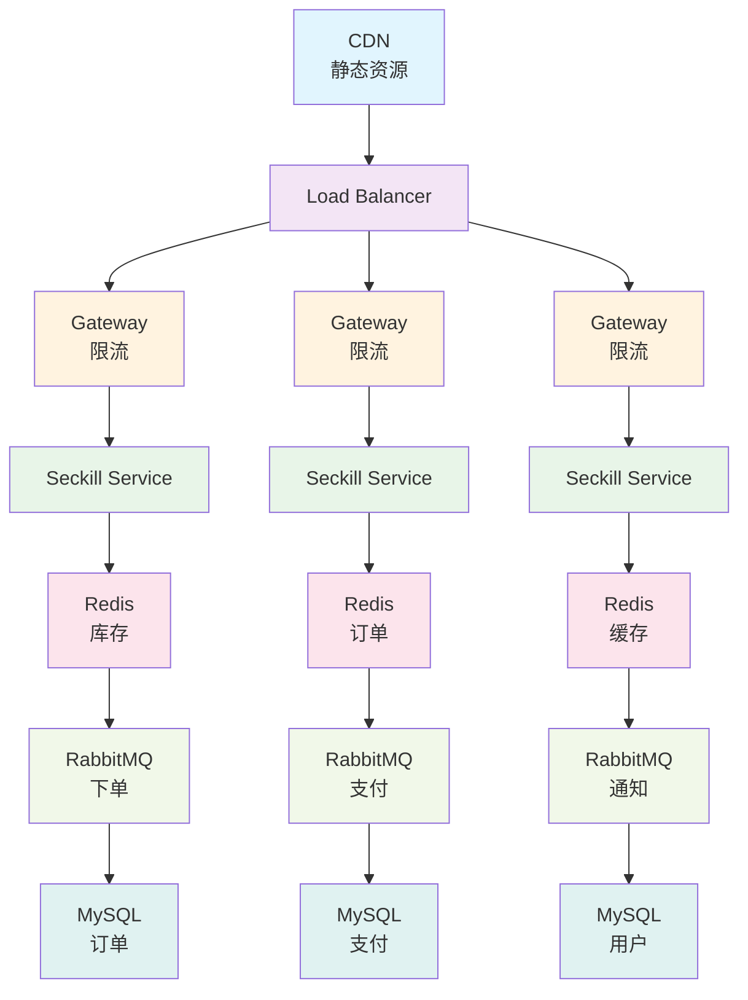
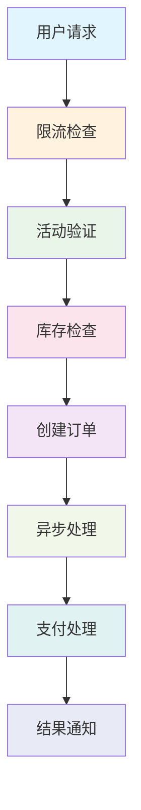

# 秒杀系统设计详解

> 秒杀系统是高并发场景的典型应用，其架构设计体现了分布式系统的核心挑战

## 秒杀系统概述

### 1. 系统特点



### 2. 架构设计原则



## 秒杀系统架构

### 1. 整体架构



### 2. 数据流设计



## 核心功能实现

### 1. 秒杀活动管理

**秒杀活动服务**
```java
@Service
@Transactional
public class SeckillActivityService {
    
    @Autowired
    private SeckillActivityRepository activityRepository;
    
    @Autowired
    private RedisTemplate<String, String> redisTemplate;
    
    // 创建秒杀活动
    public SeckillActivity createActivity(SeckillActivityCreateRequest request) {
        // 1. 验证活动时间
        if (request.getStartTime().after(request.getEndTime())) {
            throw new BusinessException("活动时间不正确");
        }
        
        // 2. 验证商品
        Product product = productService.getProduct(request.getProductId());
        if (product == null) {
            throw new BusinessException("商品不存在");
        }
        
        // 3. 验证库存
        if (request.getStock() <= 0) {
            throw new BusinessException("库存必须大于0");
        }
        
        // 4. 创建活动
        SeckillActivity activity = new SeckillActivity();
        activity.setName(request.getName());
        activity.setProductId(request.getProductId());
        activity.setOriginalPrice(product.getPrice());
        activity.setSeckillPrice(request.getSeckillPrice());
        activity.setStock(request.getStock());
        activity.setStartTime(request.getStartTime());
        activity.setEndTime(request.getEndTime());
        activity.setStatus(SeckillActivityStatus.PENDING);
        activity.setCreateTime(new Date());
        
        activity = activityRepository.save(activity);
        
        // 5. 预热库存到Redis
        warmupStockToRedis(activity);
        
        // 6. 预热活动信息到缓存
        warmupActivityToCache(activity);
        
        return activity;
    }
    
    // 预热库存到Redis
    private void warmupStockToRedis(SeckillActivity activity) {
        String stockKey = "seckill:stock:" + activity.getId();
        redisTemplate.opsForValue().set(stockKey, String.valueOf(activity.getStock()));
        
        // 设置库存告警阈值
        String alertKey = "seckill:stock:alert:" + activity.getId();
        redisTemplate.opsForValue().set(alertKey, String.valueOf(activity.getStock() * 0.1));
    }
    
    // 预热活动信息到缓存
    private void warmupActivityToCache(SeckillActivity activity) {
        String cacheKey = "seckill:activity:" + activity.getId();
        redisTemplate.opsForValue().set(cacheKey, JSON.toJSONString(activity), 1, TimeUnit.HOURS);
    }
    
    // 获取活动信息
    public SeckillActivity getActivity(Long activityId) {
        String cacheKey = "seckill:activity:" + activityId;
        String cached = redisTemplate.opsForValue().get(cacheKey);
        
        if (cached != null) {
            return JSON.parseObject(cached, SeckillActivity.class);
        }
        
        SeckillActivity activity = activityRepository.findById(activityId)
            .orElseThrow(() -> new BusinessException("活动不存在"));
        
        // 缓存活动信息
        redisTemplate.opsForValue().set(cacheKey, JSON.toJSONString(activity), 1, TimeUnit.HOURS);
        
        return activity;
    }
    
    // 检查活动状态
    public boolean isActivityValid(Long activityId) {
        SeckillActivity activity = getActivity(activityId);
        
        // 检查活动状态
        if (activity.getStatus() != SeckillActivityStatus.RUNNING) {
            return false;
        }
        
        // 检查活动时间
        Date now = new Date();
        if (now.before(activity.getStartTime()) || now.after(activity.getEndTime())) {
            return false;
        }
        
        return true;
    }
    
    // 获取剩余库存
    public int getRemainingStock(Long activityId) {
        String stockKey = "seckill:stock:" + activityId;
        String stock = redisTemplate.opsForValue().get(stockKey);
        
        if (stock != null) {
            return Integer.parseInt(stock);
        }
        
        return 0;
    }
    
    // 开始活动
    public void startActivity(Long activityId) {
        SeckillActivity activity = getActivity(activityId);
        activity.setStatus(SeckillActivityStatus.RUNNING);
        activity.setStartTime(new Date());
        activityRepository.save(activity);
        
        // 更新缓存
        warmupActivityToCache(activity);
        
        // 发送活动开始消息
        sendActivityStartMessage(activity);
    }
    
    // 结束活动
    public void endActivity(Long activityId) {
        SeckillActivity activity = getActivity(activityId);
        activity.setStatus(SeckillActivityStatus.ENDED);
        activity.setEndTime(new Date());
        activityRepository.save(activity);
        
        // 更新缓存
        warmupActivityToCache(activity);
        
        // 发送活动结束消息
        sendActivityEndMessage(activity);
    }
    
    private void sendActivityStartMessage(SeckillActivity activity) {
        SeckillMessage message = new SeckillMessage();
        message.setActivityId(activity.getId());
        message.setAction("ACTIVITY_START");
        
        rabbitTemplate.convertAndSend("seckill.exchange", "activity.start", message);
    }
    
    private void sendActivityEndMessage(SeckillActivity activity) {
        SeckillMessage message = new SeckillMessage();
        message.setActivityId(activity.getId());
        message.setAction("ACTIVITY_END");
        
        rabbitTemplate.convertAndSend("seckill.exchange", "activity.end", message);
    }
}
```

### 2. 秒杀下单

**秒杀下单服务**
```java
@Service
@Transactional
public class SeckillOrderService {
    
    @Autowired
    private SeckillActivityService activityService;
    
    @Autowired
    private RedisTemplate<String, String> redisTemplate;
    
    @Autowired
    private RabbitTemplate rabbitTemplate;
    
    // 秒杀下单
    public SeckillResult createOrder(SeckillOrderRequest request) {
        Long userId = request.getUserId();
        Long activityId = request.getActivityId();
        
        // 1. 验证活动
        if (!activityService.isActivityValid(activityId)) {
            return SeckillResult.error("活动不存在或已结束");
        }
        
        // 2. 检查用户是否已参与
        if (hasUserParticipated(userId, activityId)) {
            return SeckillResult.error("您已参与过此活动");
        }
        
        // 3. 预扣减库存
        boolean stockReduced = reduceStock(activityId);
        if (!stockReduced) {
            return SeckillResult.error("库存不足");
        }
        
        // 4. 创建预订单
        SeckillOrder order = createPreOrder(request);
        
        // 5. 标记用户已参与
        markUserParticipated(userId, activityId);
        
        // 6. 发送异步下单消息
        sendCreateOrderMessage(order);
        
        return SeckillResult.success("抢购成功，正在处理订单");
    }
    
    // 预扣减库存
    private boolean reduceStock(Long activityId) {
        String stockKey = "seckill:stock:" + activityId;
        String script = 
            "local stock = redis.call('GET', KEYS[1]) " +
            "if tonumber(stock) <= 0 then " +
            "  return 0 " +
            "end " +
            "redis.call('DECR', KEYS[1]) " +
            "return 1";
        
        Long result = redisTemplate.execute(
            new DefaultRedisScript<>(script, Long.class),
            Collections.singletonList(stockKey)
        );
        
        return result != null && result == 1;
    }
    
    // 创建预订单
    private SeckillOrder createPreOrder(SeckillOrderRequest request) {
        SeckillOrder order = new SeckillOrder();
        order.setOrderNo(generateOrderNo());
        order.setUserId(request.getUserId());
        order.setActivityId(request.getActivityId());
        order.setProductId(request.getProductId());
        order.setQuantity(1);
        order.setStatus(SeckillOrderStatus.PENDING);
        order.setCreateTime(new Date());
        
        return seckillOrderRepository.save(order);
    }
    
    // 检查用户是否已参与
    private boolean hasUserParticipated(Long userId, Long activityId) {
        String key = "seckill:user:" + activityId;
        return redisTemplate.opsForSet().isMember(key, userId.toString());
    }
    
    // 标记用户已参与
    private void markUserParticipated(Long userId, Long activityId) {
        String key = "seckill:user:" + activityId;
        redisTemplate.opsForSet().add(key, userId.toString());
        redisTemplate.expire(key, 1, TimeUnit.DAYS);
    }
    
    // 异步创建订单
    @RabbitListener(queues = "seckill.order.queue")
    public void asyncCreateOrder(SeckillOrderMessage message) {
        try {
            SeckillOrder order = seckillOrderRepository.findById(message.getOrderId())
                .orElseThrow(() -> new BusinessException("订单不存在"));
            
            // 1. 创建正式订单
            Order formalOrder = createFormalOrder(order);
            
            // 2. 更新订单状态
            order.setStatus(SeckillOrderStatus.SUCCESS);
            order.setFormalOrderId(formalOrder.getId());
            order.setUpdateTime(new Date());
            seckillOrderRepository.save(order);
            
            // 3. 发送订单创建成功消息
            sendOrderSuccessMessage(order, formalOrder);
            
        } catch (Exception e) {
            // 处理失败，回滚库存
            rollbackStock(message.getActivityId());
            
            // 更新订单状态
            SeckillOrder order = seckillOrderRepository.findById(message.getOrderId()).orElse(null);
            if (order != null) {
                order.setStatus(SeckillOrderStatus.FAILED);
                order.setFailReason(e.getMessage());
                order.setUpdateTime(new Date());
                seckillOrderRepository.save(order);
            }
            
            // 发送订单创建失败消息
            sendOrderFailedMessage(message, e.getMessage());
        }
    }
    
    // 创建正式订单
    private Order createFormalOrder(SeckillOrder seckillOrder) {
        Order order = new Order();
        order.setOrderNo(generateOrderNo());
        order.setUserId(seckillOrder.getUserId());
        order.setProductId(seckillOrder.getProductId());
        order.setQuantity(seckillOrder.getQuantity());
        
        // 获取秒杀价格
        SeckillActivity activity = activityService.getActivity(seckillOrder.getActivityId());
        order.setPrice(activity.getSeckillPrice());
        order.setTotalAmount(activity.getSeckillPrice());
        order.setPayAmount(activity.getSeckillPrice());
        
        order.setStatus(OrderStatus.PENDING_PAYMENT);
        order.setCreateTime(new Date());
        
        return orderRepository.save(order);
    }
    
    // 回滚库存
    private void rollbackStock(Long activityId) {
        String stockKey = "seckill:stock:" + activityId;
        redisTemplate.opsForValue().increment(stockKey);
    }
    
    // 发送订单成功消息
    private void sendOrderSuccessMessage(SeckillOrder seckillOrder, Order formalOrder) {
        SeckillMessage message = new SeckillMessage();
        message.setUserId(seckillOrder.getUserId());
        message.setOrderId(formalOrder.getId());
        message.setAction("ORDER_SUCCESS");
        
        rabbitTemplate.convertAndSend("seckill.exchange", "order.success", message);
    }
    
    // 发送订单失败消息
    private void sendOrderFailedMessage(SeckillOrderMessage message, String reason) {
        SeckillMessage seckillMessage = new SeckillMessage();
        seckillMessage.setUserId(message.getUserId());
        seckillMessage.setOrderId(message.getOrderId());
        seckillMessage.setAction("ORDER_FAILED");
        seckillMessage.setReason(reason);
        
        rabbitTemplate.convertAndSend("seckill.exchange", "order.failed", seckillMessage);
    }
    
    private String generateOrderNo() {
        return "SK" + System.currentTimeMillis() + 
               String.format("%04d", new Random().nextInt(10000));
    }
}
```

### 3. 限流和防刷

**限流服务**
```java
@Service
public class SeckillRateLimitService {
    
    @Autowired
    private RedisTemplate<String, String> redisTemplate;
    
    // 接口级别限流
    public boolean tryAcquire(String key, int permits, int rate) {
        String limitKey = "seckill:limit:" + key;
        String script = 
            "local current = redis.call('GET', KEYS[1]) " +
            "if current == false then " +
            "  redis.call('SET', KEYS[1], ARGV[1]) " +
            "  redis.call('EXPIRE', KEYS[1], ARGV[2]) " +
            "  return 1 " +
            "else " +
            "  if tonumber(current) < tonumber(ARGV[3]) then " +
            "    return redis.call('INCR', KEYS[1]) " +
            "  else " +
            "    return 0 " +
            "  end " +
            "end";
        
        Long result = redisTemplate.execute(
            new DefaultRedisScript<>(script, Long.class),
            Collections.singletonList(limitKey),
            "1",
            "1",
            String.valueOf(rate)
        );
        
        return result != null && result == 1;
    }
    
    // 用户级别限流
    public boolean tryAcquireUser(Long userId, Long activityId) {
        String userKey = "seckill:user:limit:" + activityId + ":" + userId;
        return tryAcquire(userKey, 1, 1); // 每个用户每秒只能抢购一次
    }
    
    // 活动级别限流
    public boolean tryAcquireActivity(Long activityId) {
        String activityKey = "seckill:activity:limit:" + activityId;
        return tryAcquire(activityKey, 1000, 1000); // 每个活动每秒1000次请求
    }
    
    // 滑动窗口限流
    public boolean tryAcquireSlidingWindow(String key, int permits, int windowSize) {
        String windowKey = "seckill:window:" + key;
        long currentTime = System.currentTimeMillis();
        
        // 清理过期记录
        redisTemplate.execute(
            new DefaultRedisScript<>(CLEANUP_SCRIPT, Long.class),
            Collections.singletonList(windowKey),
            String.valueOf(currentTime - windowSize * 1000)
        );
        
        // 检查当前窗口内的请求数
        Long currentCount = redisTemplate.opsForZSet().count(windowKey, 
            currentTime - windowSize * 1000, currentTime);
        
        if (currentCount < permits) {
            // 添加当前请求
            redisTemplate.opsForZSet().add(windowKey, 
                String.valueOf(currentTime), currentTime);
            return true;
        }
        
        return false;
    }
    
    // 令牌桶限流
    public boolean tryAcquireTokenBucket(String key, int capacity, double refillRate) {
        String bucketKey = "seckill:bucket:" + key;
        String script = 
            "local capacity = tonumber(ARGV[1]) " +
            "local tokens = tonumber(ARGV[2]) " +
            "local interval = tonumber(ARGV[3]) " +
            "local now = tonumber(ARGV[4]) " +
            "local bucket_key = KEYS[1] " +
            "local bucket = redis.call('HMGET', bucket_key, 'tokens', 'last_refill') " +
            "local current_tokens = tonumber(bucket[1]) " +
            "local last_refill = tonumber(bucket[2]) " +
            "if current_tokens == nil then " +
            "  current_tokens = capacity " +
            "  last_refill = now " +
            "end " +
            "local elapsed = now - last_refill " +
            "local tokens_to_add = math.floor(elapsed / interval * tokens) " +
            "current_tokens = math.min(capacity, current_tokens + tokens_to_add) " +
            "if current_tokens >= 1 then " +
            "  current_tokens = current_tokens - 1 " +
            "  redis.call('HMSET', bucket_key, 'tokens', current_tokens, 'last_refill', now) " +
            "  redis.call('EXPIRE', bucket_key, interval * 2) " +
            "  return 1 " +
            "else " +
            "  redis.call('HMSET', bucket_key, 'tokens', current_tokens, 'last_refill', now) " +
            "  redis.call('EXPIRE', bucket_key, interval * 2) " +
            "  return 0 " +
            "end";
        
        Long result = redisTemplate.execute(
            new DefaultRedisScript<>(script, Long.class),
            Collections.singletonList(bucketKey),
            String.valueOf(capacity),
            String.valueOf(refillRate),
            "1000",
            String.valueOf(System.currentTimeMillis())
        );
        
        return result != null && result == 1;
    }
    
    private static final String CLEANUP_SCRIPT = 
        "redis.call('ZREMRANGEBYSCORE', KEYS[1], 0, ARGV[1]) " +
        "return redis.call('ZCARD', KEYS[1])";
}
```

### 4. 缓存优化

**缓存服务**
```java
@Service
public class SeckillCacheService {
    
    @Autowired
    private RedisTemplate<String, String> redisTemplate;
    
    // 预热活动页面
    public void warmupActivityPage(Long activityId) {
        // 1. 生成静态页面
        String html = generateActivityPage(activityId);
        
        // 2. 缓存页面
        String pageKey = "seckill:page:" + activityId;
        redisTemplate.opsForValue().set(pageKey, html, 1, TimeUnit.HOURS);
        
        // 3. 推送到CDN
        pushToCdn(activityId, html);
    }
    
    // 生成活动页面
    private String generateActivityPage(Long activityId) {
        SeckillActivity activity = activityService.getActivity(activityId);
        Product product = productService.getProduct(activity.getProductId());
        
        // 使用模板引擎生成页面
        Map<String, Object> model = new HashMap<>();
        model.put("activity", activity);
        model.put("product", product);
        model.put("remainingStock", activityService.getRemainingStock(activityId));
        
        return templateEngine.process("seckill/activity", model);
    }
    
    // 推送到CDN
    private void pushToCdn(Long activityId, String html) {
        String cdnUrl = "https://cdn.example.com/seckill/" + activityId + ".html";
        
        // 调用CDN API推送内容
        cdnService.pushContent(cdnUrl, html);
    }
    
    // 缓存商品信息
    public void warmupProductInfo(Long productId) {
        Product product = productService.getProduct(productId);
        
        String productKey = "seckill:product:" + productId;
        redisTemplate.opsForValue().set(productKey, JSON.toJSONString(product), 1, TimeUnit.HOURS);
    }
    
    // 缓存用户信息
    public void warmupUserInfo(Long userId) {
        User user = userService.getUser(userId);
        
        String userKey = "seckill:user:" + userId;
        redisTemplate.opsForValue().set(userKey, JSON.toJSONString(user), 30, TimeUnit.MINUTES);
    }
    
    // 获取缓存页面
    public String getCachedPage(Long activityId) {
        String pageKey = "seckill:page:" + activityId;
        return redisTemplate.opsForValue().get(pageKey);
    }
    
    // 获取缓存商品信息
    public Product getCachedProduct(Long productId) {
        String productKey = "seckill:product:" + productId;
        String cached = redisTemplate.opsForValue().get(productKey);
        
        if (cached != null) {
            return JSON.parseObject(cached, Product.class);
        }
        
        return null;
    }
    
    // 获取缓存用户信息
    public User getCachedUser(Long userId) {
        String userKey = "seckill:user:" + userId;
        String cached = redisTemplate.opsForValue().get(userKey);
        
        if (cached != null) {
            return JSON.parseObject(cached, User.class);
        }
        
        return null;
    }
    
    // 更新库存缓存
    public void updateStockCache(Long activityId, int stock) {
        String stockKey = "seckill:stock:" + activityId;
        redisTemplate.opsForValue().set(stockKey, String.valueOf(stock));
        
        // 检查库存告警
        checkStockAlert(activityId, stock);
    }
    
    // 检查库存告警
    private void checkStockAlert(Long activityId, int stock) {
        String alertKey = "seckill:stock:alert:" + activityId;
        String alertStr = redisTemplate.opsForValue().get(alertKey);
        
        if (alertStr != null) {
            int alertThreshold = Integer.parseInt(alertStr);
            
            if (stock <= alertThreshold) {
                // 发送库存告警
                sendStockAlert(activityId, stock);
            }
        }
    }
    
    // 发送库存告警
    private void sendStockAlert(Long activityId, int stock) {
        SeckillMessage message = new SeckillMessage();
        message.setActivityId(activityId);
        message.setAction("STOCK_ALERT");
        message.setStock(stock);
        
        rabbitTemplate.convertAndSend("seckill.exchange", "stock.alert", message);
    }
}
```

## 前端优化

### 1. 页面静态化

**页面控制器**
```java
@Controller
@RequestMapping("/seckill")
public class SeckillPageController {
    
    @Autowired
    private SeckillCacheService cacheService;
    
    @Autowired
    private SeckillActivityService activityService;
    
    // 秒杀活动页面
    @GetMapping("/activity/{activityId}")
    public String activityPage(@PathVariable Long activityId, Model model) {
        // 尝试从缓存获取页面
        String cachedPage = cacheService.getCachedPage(activityId);
        
        if (cachedPage != null) {
            return cachedPage;
        }
        
        // 获取活动信息
        SeckillActivity activity = activityService.getActivity(activityId);
        Product product = cacheService.getCachedProduct(activity.getProductId());
        
        // 检查活动状态
        boolean isValid = activityService.isActivityValid(activityId);
        int remainingStock = activityService.getRemainingStock(activityId);
        
        model.addAttribute("activity", activity);
        model.addAttribute("product", product);
        model.addAttribute("isValid", isValid);
        model.addAttribute("remainingStock", remainingStock);
        
        return "seckill/activity";
    }
    
    // 秒杀结果页面
    @GetMapping("/result/{orderNo}")
    public String resultPage(@PathVariable String orderNo, Model model) {
        SeckillOrder order = seckillOrderRepository.findByOrderNo(orderNo);
        
        model.addAttribute("order", order);
        
        return "seckill/result";
    }
    
    // 获取活动状态（AJAX接口）
    @GetMapping("/api/activity/{activityId}/status")
    @ResponseBody
    public Map<String, Object> getActivityStatus(@PathVariable Long activityId) {
        Map<String, Object> result = new HashMap<>();
        
        SeckillActivity activity = activityService.getActivity(activityId);
        boolean isValid = activityService.isActivityValid(activityId);
        int remainingStock = activityService.getRemainingStock(activityId);
        
        result.put("valid", isValid);
        result.put("remainingStock", remainingStock);
        result.put("startTime", activity.getStartTime());
        result.put("endTime", activity.getEndTime());
        
        return result;
    }
}
```

### 2. 前端秒杀逻辑

**JavaScript秒杀代码**
```javascript
class SeckillManager {
    constructor(activityId) {
        this.activityId = activityId;
        this.userId = getCurrentUserId();
        this.isSubmitting = false;
        this.countdownTimer = null;
        
        this.init();
    }
    
    init() {
        // 绑定事件
        this.bindEvents();
        
        // 开始倒计时
        this.startCountdown();
        
        // 定期更新库存
        this.updateStockPeriodically();
    }
    
    bindEvents() {
        const seckillBtn = document.getElementById('seckill-btn');
        seckillBtn.addEventListener('click', () => this.handleSeckill());
        
        const refreshBtn = document.getElementById('refresh-btn');
        refreshBtn.addEventListener('click', () => this.updateStock());
    }
    
    startCountdown() {
        this.updateCountdown();
        this.countdownTimer = setInterval(() => this.updateCountdown(), 1000);
    }
    
    updateCountdown() {
        fetch(`/seckill/api/activity/${this.activityId}/status`)
            .then(response => response.json())
            .then(data => {
                const seckillBtn = document.getElementById('seckill-btn');
                const countdownEl = document.getElementById('countdown');
                
                if (!data.valid) {
                    seckillBtn.disabled = true;
                    seckillBtn.textContent = '活动已结束';
                    clearInterval(this.countdownTimer);
                    return;
                }
                
                const now = new Date().getTime();
                const startTime = new Date(data.startTime).getTime();
                const endTime = new Date(data.endTime).getTime();
                
                if (now < startTime) {
                    // 活动未开始
                    const distance = startTime - now;
                    const hours = Math.floor(distance / (1000 * 60 * 60));
                    const minutes = Math.floor((distance % (1000 * 60 * 60)) / (1000 * 60));
                    const seconds = Math.floor((distance % (1000 * 60)) / 1000);
                    
                    countdownEl.textContent = `${hours}时${minutes}分${seconds}秒`;
                    seckillBtn.disabled = true;
                    seckillBtn.textContent = '即将开始';
                } else if (now > endTime) {
                    // 活动已结束
                    seckillBtn.disabled = true;
                    seckillBtn.textContent = '活动已结束';
                    clearInterval(this.countdownTimer);
                } else {
                    // 活动进行中
                    countdownEl.textContent = '活动进行中';
                    seckillBtn.disabled = false;
                    seckillBtn.textContent = '立即抢购';
                }
                
                // 更新库存显示
                this.updateStockDisplay(data.remainingStock);
            })
            .catch(error => {
                console.error('获取活动状态失败:', error);
            });
    }
    
    updateStockPeriodically() {
        setInterval(() => this.updateStock(), 5000); // 每5秒更新一次
    }
    
    updateStock() {
        fetch(`/seckill/api/activity/${this.activityId}/status`)
            .then(response => response.json())
            .then(data => {
                this.updateStockDisplay(data.remainingStock);
            })
            .catch(error => {
                console.error('获取库存信息失败:', error);
            });
    }
    
    updateStockDisplay(stock) {
        const stockEl = document.getElementById('stock');
        stockEl.textContent = `剩余库存: ${stock}`;
        
        if (stock <= 10) {
            stockEl.classList.add('low-stock');
        } else {
            stockEl.classList.remove('low-stock');
        }
    }
    
    async handleSeckill() {
        if (this.isSubmitting) {
            return;
        }
        
        this.isSubmitting = true;
        const seckillBtn = document.getElementById('seckill-btn');
        const originalText = seckillBtn.textContent;
        
        try {
            seckillBtn.disabled = true;
            seckillBtn.textContent = '抢购中...';
            
            const response = await fetch('/seckill/api/order/create', {
                method: 'POST',
                headers: {
                    'Content-Type': 'application/json',
                },
                body: JSON.stringify({
                    userId: this.userId,
                    activityId: this.activityId
                })
            });
            
            const result = await response.json();
            
            if (result.success) {
                // 抢购成功，跳转到结果页面
                window.location.href = `/seckill/result/${result.data.orderNo}`;
            } else {
                // 抢购失败，显示错误信息
                this.showError(result.message);
                seckillBtn.disabled = false;
                seckillBtn.textContent = originalText;
            }
        } catch (error) {
            console.error('抢购失败:', error);
            this.showError('网络错误，请重试');
            seckillBtn.disabled = false;
            seckillBtn.textContent = originalText;
        } finally {
            this.isSubmitting = false;
        }
    }
    
    showError(message) {
        const errorEl = document.getElementById('error-message');
        errorEl.textContent = message;
        errorEl.style.display = 'block';
        
        // 3秒后自动隐藏
        setTimeout(() => {
            errorEl.style.display = 'none';
        }, 3000);
    }
}

// 使用示例
document.addEventListener('DOMContentLoaded', () => {
    const activityId = getQueryParameter('activityId');
    new SeckillManager(activityId);
});

function getQueryParameter(name) {
    const urlParams = new URLSearchParams(window.location.search);
    return urlParams.get(name);
}

function getCurrentUserId() {
    // 从cookie或localStorage获取用户ID
    return localStorage.getItem('userId') || '';
}
```

## 监控和告警

### 1. 性能监控

**监控服务**
```java
@Component
public class SeckillMonitorService {
    
    @Autowired
    private MeterRegistry meterRegistry;
    
    // 记录秒杀请求
    public void recordSeckillRequest(Long activityId, boolean success) {
        Counter.builder("seckill.requests")
            .tag("activity", activityId.toString())
            .tag("result", success ? "success" : "failed")
            .register(meterRegistry)
            .increment();
    }
    
    // 记录库存变化
    public void recordStockChange(Long activityId, int stock) {
        Gauge.builder("seckill.stock")
            .tag("activity", activityId.toString())
            .register(meterRegistry, this, obj -> stock);
    }
    
    // 记录QPS
    public void recordQPS(Long activityId, int qps) {
        Gauge.builder("seckill.qps")
            .tag("activity", activityId.toString())
            .register(meterRegistry, this, obj -> qps);
    }
    
    // 记录响应时间
    public void recordResponseTime(Long activityId, long responseTime) {
        Timer.builder("seckill.response.time")
            .tag("activity", activityId.toString())
            .register(meterRegistry)
            .record(responseTime, TimeUnit.MILLISECONDS);
    }
    
    // 记录错误率
    public void recordErrorRate(Long activityId, double errorRate) {
        Gauge.builder("seckill.error.rate")
            .tag("activity", activityId.toString())
            .register(meterRegistry, this, obj -> errorRate);
    }
}
```

## 总结

秒杀系统设计的关键点：

1. **高并发处理**：通过限流、缓存、异步等方式处理高并发
2. **数据一致性**：使用分布式锁、事务保证数据一致性
3. **系统稳定性**：通过降级、熔断保证系统稳定
4. **用户体验**：通过页面静态化、前端优化提升用户体验
5. **监控告警**：完善的监控体系及时发现问题

通过合理的技术选型和架构设计，可以构建稳定高效的秒杀系统。