# Uniswap V2详解

## 概述

Uniswap V2是以太坊上最大的去中心化交易所(DEX)协议，通过自动做市商(AMM)机制实现了无需订单簿的代币交换。本文深入解析Uniswap V2的核心机制、数学原理和实现细节。

## AMM机制基础

### 恒定乘积公式

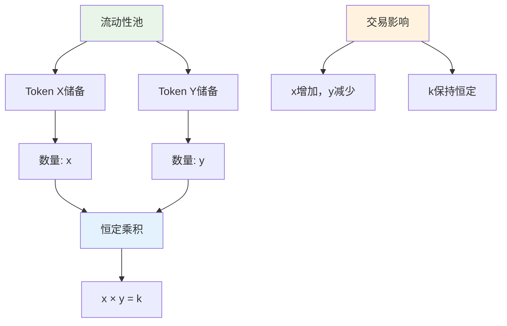

### 价格发现机制

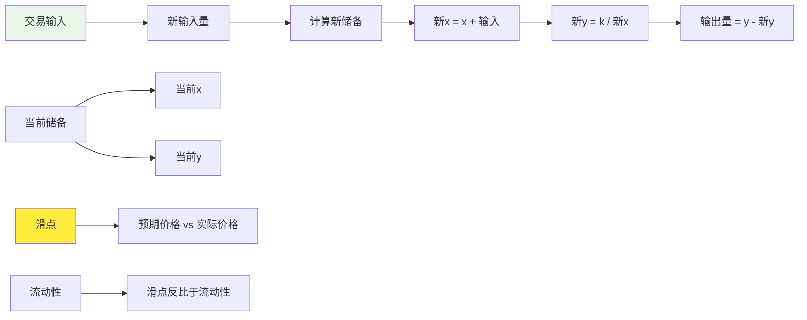

## 核心合约架构

### Uniswap V2合约系统

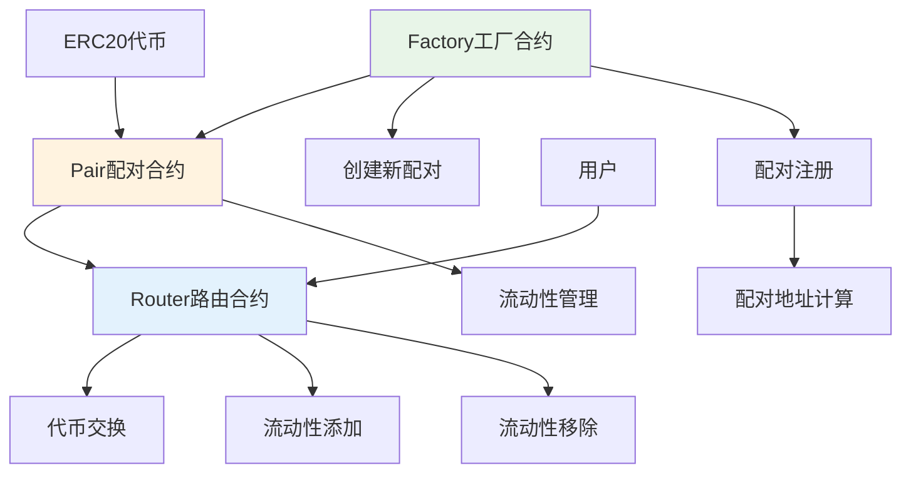

### Factory合约功能

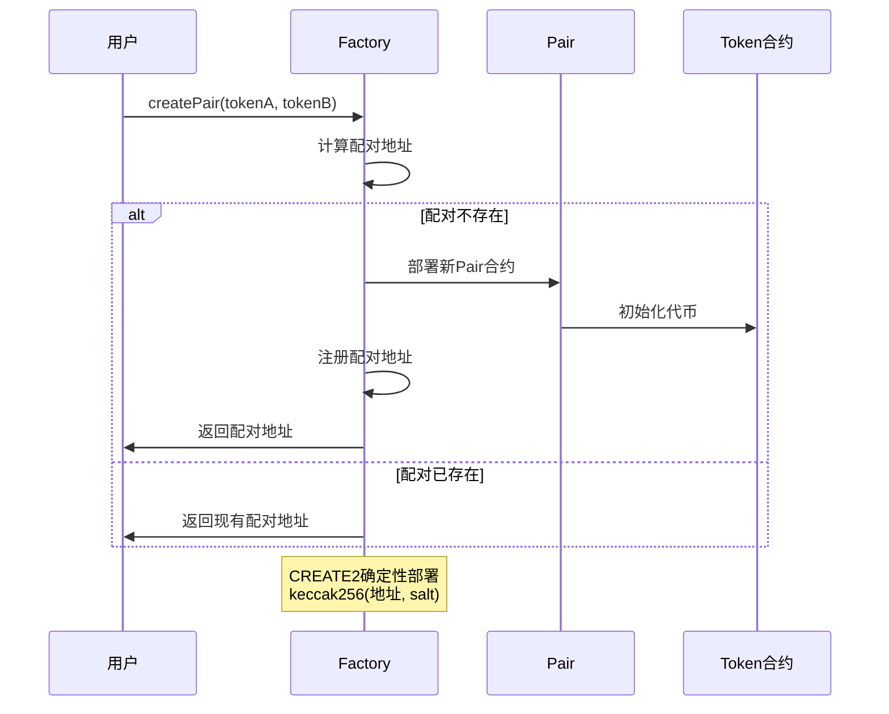

## 流动性机制

### 流动性提供

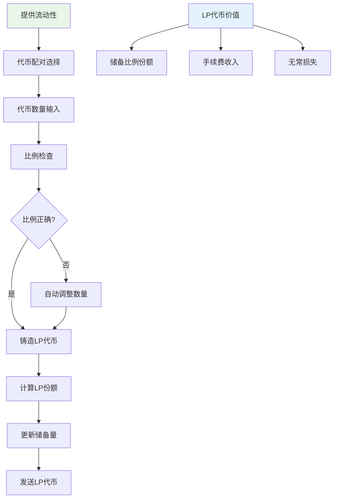

### LP代币机制

```mermaid
graph LR
    A[LP代币] --> B[代表流动性份额]
    A --> C[可转让]
    A --> D[可组合]
    
    B --> E[储备量比例]
    B --> F[手续费分配]
    
    G[LP代币计算] --> H[最小流动性]
    G --> I[份额 = min(x, y)]
    
    J[无常损失] --> K[价格波动影响]
    J --> L[与相关性成反比]
    
    style A fill:#e8f5e8
    style J fill:#ffeb3b
```

## 交易机制详解

### 交易执行流程

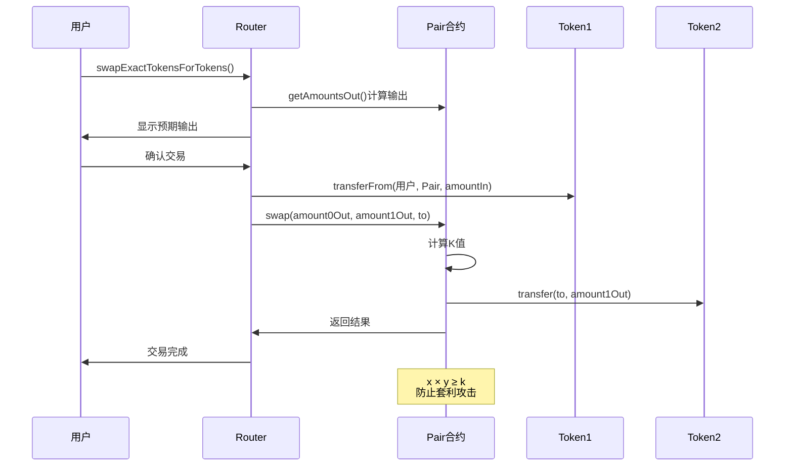

### 多跳交易

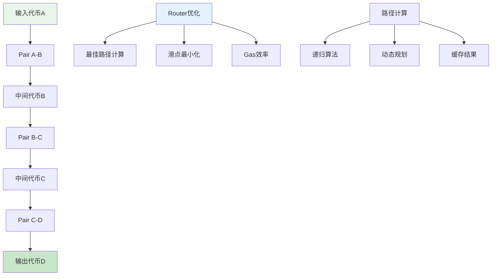

## 手续费机制

### 手续费分配

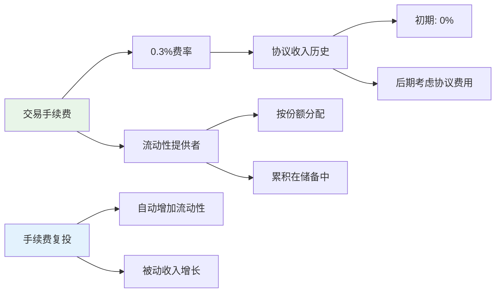

### 费用累积效应

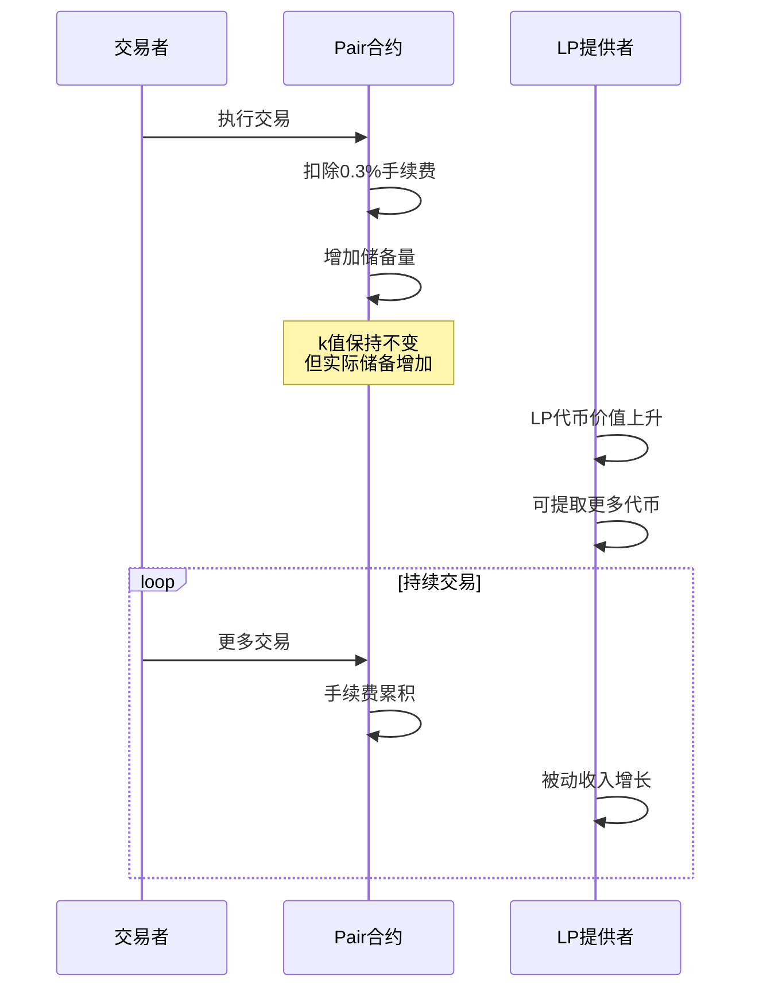

## 价格预言机

### TWAP机制

```mermaid
graph TD
    A[价格预言机] --> B[累积价格变量]
    A --> C[时间加权平均价格]
    
    B --> D[价格 × 时间]
    B --> E[每次交易更新]
    
    C --> F[TWAP计算]
    F --> G[价格1 - 价格0] / [时间1 - 时间0]
    
    H[抗操纵] --> I[需要两笔交易]
    H --> J[时间间隔保护]
    H --> K[套利平衡]
    
    style A fill:#e8f5e8
    style H fill:#e3f2fd
```

### 价格计算示例

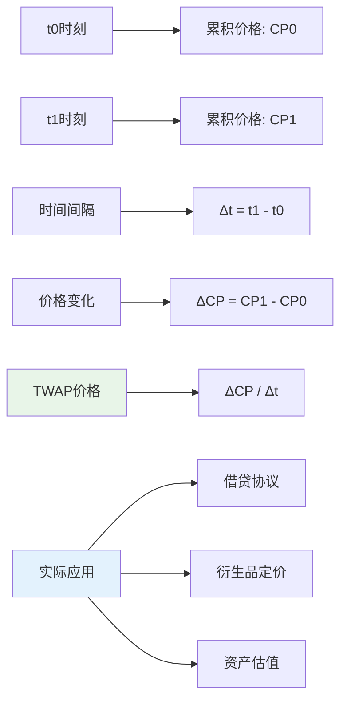

## 安全机制

### 套利机制

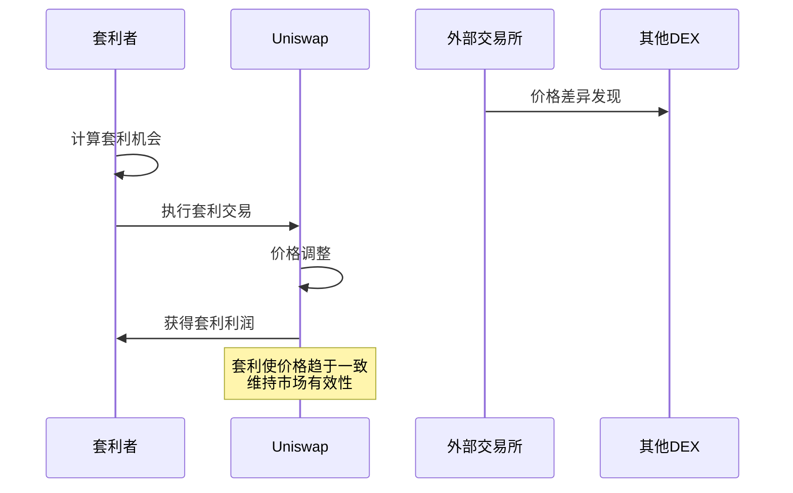

### 无常损失

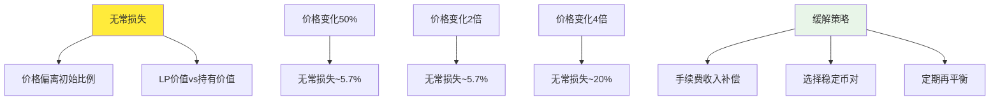

## 高级特性

### Flash Loan(闪电贷)

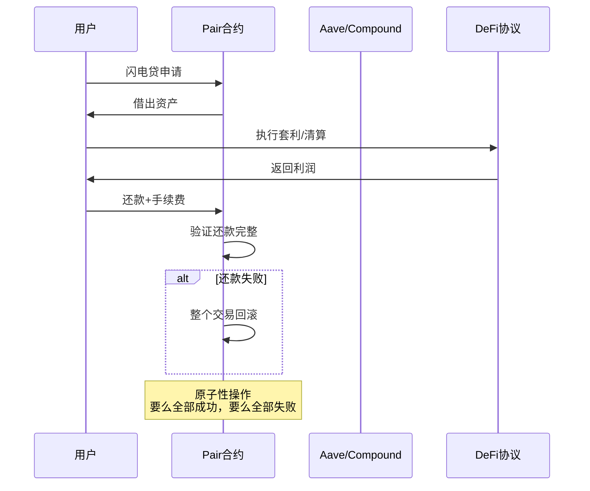

### 治理机制

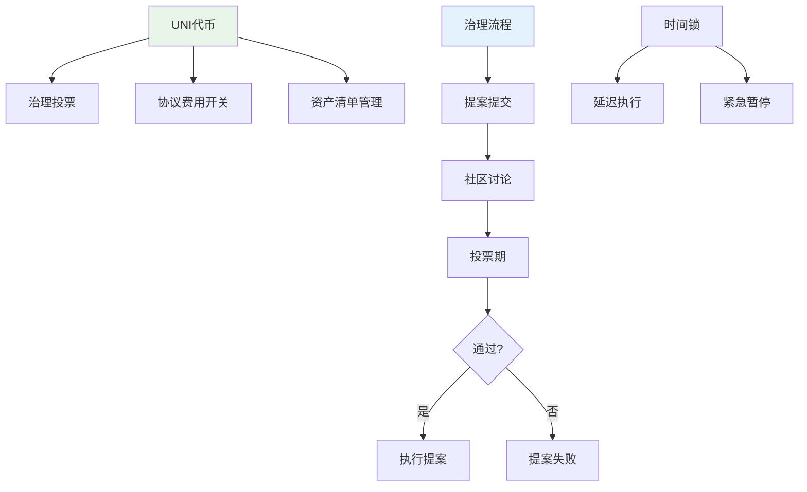

## 性能优化

### Gas优化策略

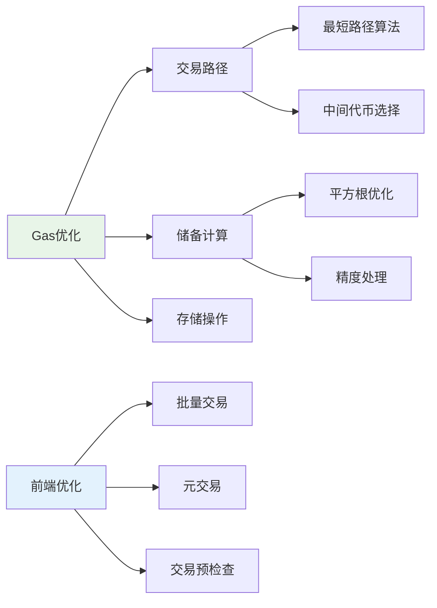

## 实际应用案例

### 跨链桥接

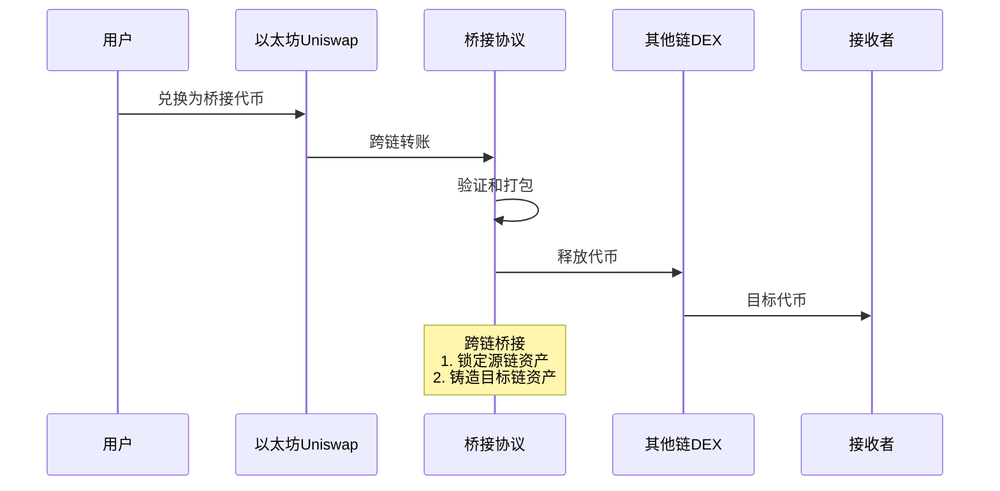

### 收益聚合器

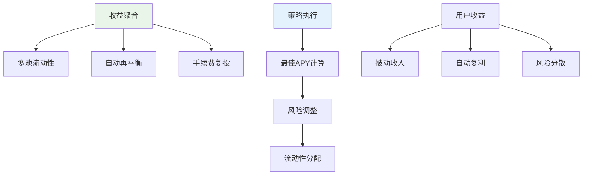

## 总结

Uniswap V2作为DeFi领域的基石协议，其创新性的AMM机制彻底改变了数字资产交易的方式：

### 核心创新

1. **自动做市商**：无需订单簿的连续交易模式
2. **流动性挖矿**：激励流动性提供的经济模型
3. **价格预言机**：抗操纵的价格发现机制
4. **组合性**：可与其他DeFi协议无缝集成

### 关键特性

- **恒定乘积公式**：x × y = k 确保流动性
- **LP代币**：代表流动性份额的可组合资产
- **TWAP预言机**：时间加权平均价格机制
- **闪电贷**：无需抵押的即时借贷

### 发展前景

随着DeFi生态的持续发展，Uniswap V2的设计理念深刻影响了整个行业，为去中心化金融奠定了坚实的基础。其后续版本Uniswap V3在资本效率和用户体验上进一步优化，但V2的核心原理依然是理解现代DEX协议的关键。